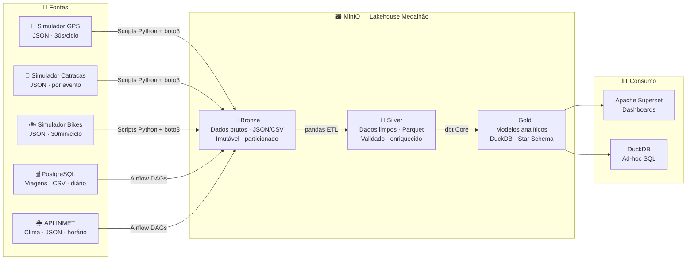
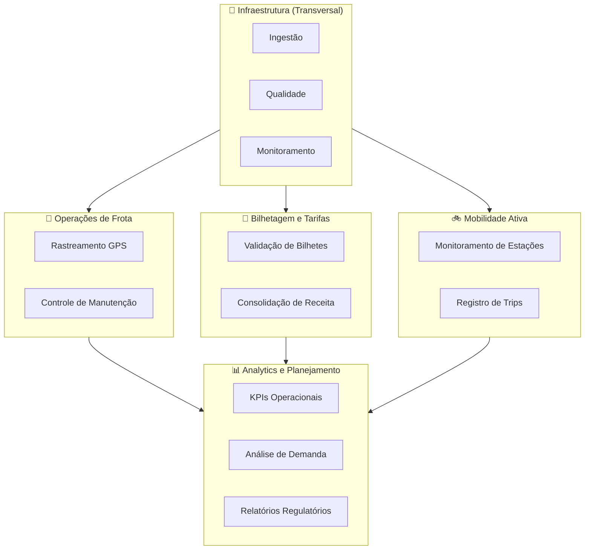
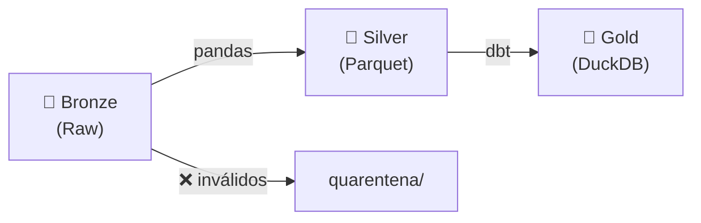

# UrbanFlow — Plataforma de Engenharia de Dados para Mobilidade Urbana

> **Disciplina:** Engenharia de Dados — Parte 1: Planejamento Arquitetural  
> **Instituição:** Centro Universitário de Brasília (CEUB)  
> **Entrega:** 30/04/2026

---

## Integrantes

| Nome Completo | Matrícula |
|---|---|
| Alice Moreira Marques | 22306521 |
| Eduardo Sousa Hirle de Freitas | 22303593 |

---

## O Projeto

A **UrbanFlow Mobilidade S.A.** opera três modais de transporte em uma cidade de 800 mil habitantes — ônibus, metrô leve e bicicletas compartilhadas — com sistemas legados completamente isolados entre si. A equipe de dados gasta 3+ dias por mês extraindo planilhas manualmente de cada sistema para gerar relatórios que deveriam ser automáticos.

Este projeto planeja e prova em conceito uma **plataforma de dados moderna** que quebra esses silos, aplicando uma arquitetura Lakehouse com Padrão Medalhão, 100% open-source e executável localmente.

```
Problema                    Solução
────────                    ───────
PostgreSQL legado (ônibus)  ╮
Software proprietário (VLT) ├─→  UrbanFlow Data Platform  ─→  Dashboards
App mobile (bicicletas)     ╯     (Bronze → Silver → Gold)     Relatórios automáticos
                                                               KPIs operacionais
```

---

## Arquitetura — Visão Geral



---

## Stack Tecnológica

| Camada | Tecnologia | Função |
|---|---|---|
| Ingestão — eventos | Scripts Python + boto3 | Simulam IoT; publicam JSON particionado no MinIO |
| Ingestão — batch | Apache Airflow | DAGs agendadas: PostgreSQL e API INMET |
| Armazenamento | MinIO | Object storage S3-compatível (Bronze, Silver, Gold) |
| ETL Bronze → Silver | Python + pandas | Limpeza, dedup, outlier flag, Parquet Snappy |
| Transformação SQL | dbt Core | Modelos Silver → Gold; 26 testes de qualidade |
| Motor analítico | DuckDB | Lê Parquet diretamente; adapter nativo do dbt |
| Visualização | Apache Superset | Dashboards BI conectados ao DuckDB |
| Banco legado | PostgreSQL | Simula sistema de bilhetagem + metadados Airflow |
| Infraestrutura | Docker Compose | `docker compose up` sobe tudo em ~2 min |

> **Requisito:** ~3 GB RAM · Docker instalado · Python 3.10+

---

## Prova de Conceito — Rodando

A POC valida a stack sem Docker. Execute e veja o pipeline ponta a ponta funcionar:

```bash
# 1. Clone o repositório
git clone https://github.com/seu-usuario/urbanflow-dataeng.git
cd urbanflow-dataeng

# 2. Instale as dependências
pip install -r requirements.txt

# 3. Execute o pipeline completo
cd poc/
python poc_demo.py
```

**Saída esperada:**
```
ETAPA 1 — Bronze: 900 eventos GPS + 300 catracas → JSON particionado
ETAPA 2 — Silver: pandas ETL → 2 Parquets Snappy (300 + 150 linhas)
ETAPA 3 — Gold:   dbt run  PASS=5   WARN=0  ERROR=0
                   dbt test PASS=26  WARN=0  ERROR=0
ETAPA 4 — DuckDB: kpi_operacional_diario (120 linhas) ✅
                   agg_demanda_por_hora   (18 linhas)  ✅
```

Evidências geradas em `poc/evidencias/` com logs reais de cada etapa.

---

## Padrão Medalhão — As Três Camadas

| Camada | Princípio | Formato | O que garante |
|---|---|---|---|
| 🥉 **Bronze** | Imutável — dados nunca sobrescritos | JSON, CSV original | Auditoria e reprocessamento sempre possíveis |
| 🥈 **Silver** | Qualidade contratada | Parquet (Snappy) | Dedup, nulos removidos, timestamps UTC, outliers sinalizados |
| 🥇 **Gold** | Produto de dados | Parquet + DuckDB | Star Schema, SLA definido, testes dbt passando |

---

## Domínios de Negócio (DDD)



---

## Qualidade de Dados



**Validações pandas (Bronze → Silver):**
- `dropna()` — campos obrigatórios não nulos
- `drop_duplicates()` — chave `(vehicle_id, timestamp)`
- Filtro `speed_kmh ∈ [0, 120]` — inválidos marcados `is_outlier=True`
- `pd.to_datetime(utc=True)` — normalização de timestamps

**Testes dbt (Silver → Gold) — 26 testes, todos passando:**
- `not_null` em todos os campos-chave
- `unique` em PKs de fatos e dimensões
- `accepted_values` — modal, direction, status, período
- `relationships` — integridade referencial entre modelos

---

## Modelos dbt Gold

| Modelo | Tipo | Descrição |
|---|---|---|
| `stg_gps_onibus` | View | GPS Silver padronizado |
| `stg_catracas` | View | Catracas Silver padronizado |
| `int_passageiros_por_hora` | View | Agregação intermediária por estação/hora |
| `kpi_operacional_diario` | **Table** | OTP, velocidade, ocupação por linha e dia |
| `agg_demanda_por_hora` | **Table** | Demanda por estação × hora × período |

---

## Estrutura do Repositório

```
urbanflow-dataeng/
│
├── README.md                          ← Este arquivo
├── requirements.txt                   ← Dependências Python
├── .env.example                       ← Template de variáveis de ambiente
├── .gitignore
│
├── docs/                              ← Documentação completa (seções 4.1–4.6)
│   ├── 01-descricao-projeto.md        ← Contexto, problema, stakeholders
│   ├── 02-definicao-dados.md          ← Fontes, schemas, classificação
│   ├── 03-dominios-servicos.md        ← DDD — domínios e serviços
│   ├── 04-arquitetura.md              ← Lakehouse, Medalhão, trade-offs
│   ├── 05-tecnologias.md              ← Stack completa com justificativas
│   └── 06-consideracoes-finais.md     ← Riscos, roadmap Parte 2, referências
│
└── poc/                               ← Prova de Conceito (roda sem Docker)
    ├── README.md                      ← Como rodar a POC
    ├── poc_demo.py                    ← Pipeline ponta a ponta (1 comando)
    ├── bronze_to_silver.py            ← ETL pandas validado
    ├── docker-compose.yml             ← Ambiente completo (Parte 2)
    │
    ├── simuladores/
    │   ├── simulador_gps.py           ← 850 veículos, modo local ou MinIO
    │   └── simulador_catracas.py      ← 18 estações, SHA-256+salt (LGPD)
    │
    ├── dbt_project/
    │   ├── dbt_project.yml
    │   ├── profiles.yml               ← DuckDB local (POC) → MinIO (prod)
    │   └── models/
    │       ├── staging/               ← stg_gps_onibus · stg_catracas
    │       ├── intermediate/          ← int_passageiros_por_hora
    │       ├── marts/                 ← kpi_operacional_diario · agg_demanda_por_hora
    │       └── schema.yml             ← 26 testes de qualidade
    │
    ├── scripts/
    │   └── init_postgres.sql          ← Banco legado com 5.000 viagens sintéticas
    │
    └── evidencias/                    ← Logs reais de cada etapa da POC
        ├── 01_bronze_gerado.txt
        ├── 02_silver_gerado.txt
        └── 04_duckdb_queries.txt
```

---

## Documentação Completa

Cada seção do enunciado corresponde a um arquivo em `docs/`:

1. [Descrição do Projeto](./docs/01-descricao-projeto.md) — contexto de negócio, AS-IS, TO-BE e stakeholders
2. [Definição e Classificação dos Dados](./docs/02-definicao-dados.md) — 5 fontes com schemas, volumes e latências
3. [Domínios e Serviços](./docs/03-dominios-servicos.md) — DDD aplicado à engenharia de dados
4. [Arquitetura e Fluxo de Dados](./docs/04-arquitetura.md) — Lakehouse + Medalhão, diagramas e trade-offs
5. [Tecnologias](./docs/05-tecnologias.md) — stack completa com justificativas e correntes transversais
6. [Considerações Finais](./docs/06-consideracoes-finais.md) — riscos, plano Parte 2 e referências

---

## Próximos Passos — Parte 2

```
Semana 1 → Docker Compose: MinIO + PostgreSQL + Airflow + Superset
Semana 2 → Simuladores publicando no MinIO + DAGs batch funcionando
Semana 3 → Pipeline pandas completo + dbt Gold com dados reais
Semana 4 → Dashboards Superset + testes finais + documentação
```