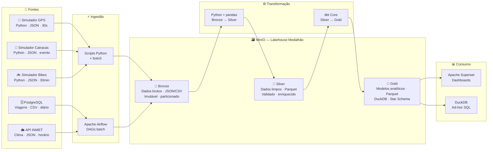

# UrbanFlow — Plataforma de Engenharia de Dados para Mobilidade Urbana

> Protótipo de Ciclo de Vida de Engenharia de Dados — Parte 1: Planejamento Arquitetural

---

## Integrantes

| Nome Completo | Matrícula |
|---|---|
| Alice Moreira Marques | 22306521 |
| Eduardo Sousa Hirle de Freitas | 22303593 |

**Disciplina:** Engenharia de Dados  
**Data de Entrega:** 30/04/2026

---

## Contexto

A **UrbanFlow Mobilidade S.A.** opera três modais de transporte em uma cidade de médio porte (≈ 800 mil habitantes): **ônibus urbanos** (120 linhas, 850 veículos), **metrô leve/VLT** (2 linhas, 18 estações) e **bicicletas compartilhadas** (80 estações, 600 bicicletas). Cada modal possui sistemas legados isolados, sem nenhuma camada de integração. A equipe de dados gasta 3+ dias por mês extraindo planilhas manualmente.

O projeto UrbanFlow constrói uma **plataforma de dados moderna** que quebra esses silos e entrega análises históricas, KPIs operacionais e relatórios regulatórios automatizados.

---

## Arquitetura — Lakehouse com Padrão Medalhão



---

## Stack Tecnológica (100% open-source e gratuita)

| Camada | Tecnologia | Função |
|---|---|---|
| Ingestão — eventos | **Scripts Python + boto3** | Simulam dispositivos IoT e publicam JSON no MinIO |
| Ingestão — batch | **Apache Airflow** | DAGs agendadas para PostgreSQL e API INMET |
| Armazenamento | **MinIO** | Object storage S3-compatível (Bronze, Silver, Gold) |
| Processamento ETL | **Python + pandas** | Limpeza, deduplicação e enriquecimento (Bronze → Silver) |
| Transformação SQL | **dbt Core** | Modelos analíticos e testes de qualidade (Silver → Gold) |
| Motor analítico | **DuckDB** | Lê Parquet do MinIO diretamente; adapter do dbt |
| Visualização | **Apache Superset** | Dashboards interativos com conexão ao DuckDB |
| Banco operacional | **PostgreSQL** | Simula sistema legado de bilhetagem; metadados do Airflow |
| Infraestrutura | **Docker Compose** | Sobe todo o ambiente com um único comando |

> **Requisito de hardware:** ~3 GB de RAM. Roda em qualquer máquina com Docker instalado.

---

## Fluxo de Dados — Visão Rápida

| Camada | O que contém | Formato |
|---|---|---|
| 🥉 **Bronze** | Dados brutos e imutáveis, exatamente como chegam das fontes | JSON, CSV |
| 🥈 **Silver** | Dados limpos, deduplicados, normalizados e enriquecidos | Parquet (Snappy) |
| 🥇 **Gold** | Modelos analíticos em Star Schema prontos para dashboards | Parquet (DuckDB) |

**Pipeline diário (executado pelo Airflow):**

```
01h00 → dag_ingest_viagens     (PostgreSQL → Bronze)
01h00 → dag_ingest_clima       (INMET → Bronze)
03h00 → dag_transform_silver   (pandas: Bronze → Silver)
04h00 → dag_dbt_gold           (dbt: Silver → Gold)
```

**Simuladores de eventos** (rodam continuamente via Docker Compose):

```
a cada 30s  → simulador_gps.py      → bronze/gps_onibus/
por evento  → simulador_catracas.py → bronze/catracas/
a cada 30min → simulador_bikes.py   → bronze/bikes_iot/
```

---

## Domínios de Negócio

O projeto é organizado em **4 domínios**, seguindo princípios de Domain-Driven Design:

| Domínio | Responsabilidade | Dados Produzidos |
|---|---|---|
| 🚌 **Operações de Frota** | Rastreamento GPS e manutenção | `fct_posicoes_diarias`, `kpi_otp_diario` |
| 🎫 **Bilhetagem e Tarifas** | Fluxo de passageiros e receita | `fct_receita_diaria`, `catracas_clean` |
| 🚲 **Mobilidade Ativa** | Disponibilidade e trips de bikes | `fct_trips_bikes`, `bikes_status_clean` |
| 📊 **Analytics e Planejamento** | KPIs, demanda e relatórios regulatórios | `kpi_operacional_diario`, `rpt_regulatorio_mensal` |

---

## Estrutura do Repositório

```
urbanflow/
│
├── README.md                          ← Este arquivo
│
└── docs/
    ├── 01-descricao-projeto.md        ← Contexto, problema e stakeholders
    ├── 02-definicao-dados.md          ← Fontes, formatos e classificação
    ├── 03-dominios-servicos.md        ← Domínios de negócio e serviços
    ├── 04-arquitetura.md              ← Fluxo de dados e decisões arquiteturais
    ├── 05-tecnologias.md              ← Stack tecnológica detalhada e justificada
    └── 06-consideracoes-finais.md     ← Riscos, próximos passos e referências
```

---

## Documentação Completa

1. [Descrição do Projeto](./docs/01-descricao-projeto.md) — contexto de negócio, problema e stakeholders
2. [Definição e Classificação dos Dados](./docs/02-definicao-dados.md) — fontes, schemas, volumes e frequências
3. [Domínios e Serviços](./docs/03-dominios-servicos.md) — DDD aplicado à engenharia de dados
4. [Arquitetura e Fluxo de Dados](./docs/04-arquitetura.md) — decisão arquitetural, diagramas e trade-offs
5. [Tecnologias](./docs/05-tecnologias.md) — stack detalhada com justificativas e exemplos de código
6. [Considerações Finais](./docs/06-consideracoes-finais.md) — riscos, plano de implementação e referências