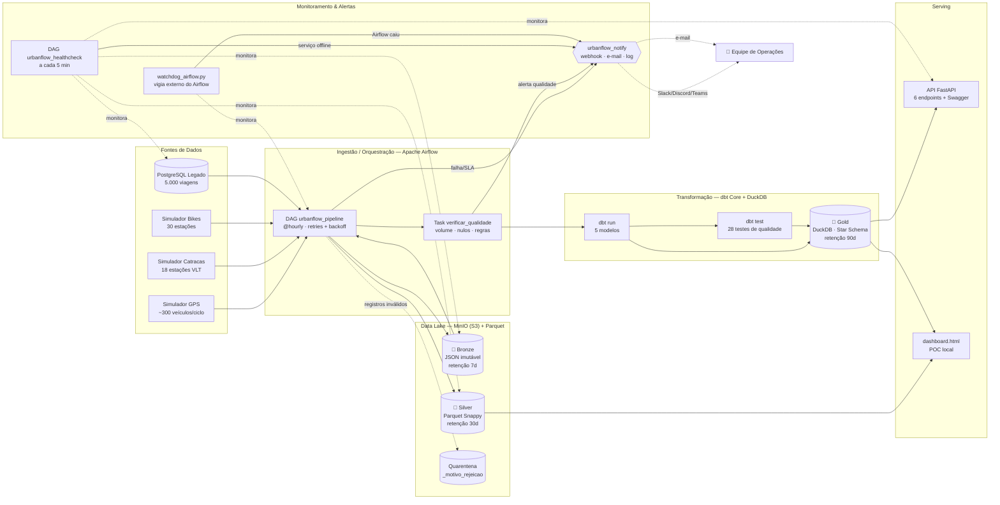

# UrbanFlow — Plataforma de Engenharia de Dados para Mobilidade Urbana

> **Disciplina:** Engenharia de Dados — **Parte 2: Implementação do Protótipo**  
> **Instituição:** Centro Universitário de Brasília (CEUB)  
> **Entrega:** 25/06/2026

---

## Integrantes

| Nome Completo                  | Matrícula |
| ------------------------------ | --------- |
| Alice Moreira Marques          | 22306521  |
| Eduardo Sousa Hirle de Freitas | 22303593  |

---

## O Projeto

A **UrbanFlow Mobilidade S.A.** opera três modais de transporte — ônibus, metrô leve (VLT) e bicicletas compartilhadas — com sistemas legados isolados. Esta plataforma implementa o ciclo completo de engenharia de dados:

```
Simuladores IoT  ──╮
Banco Legado PG  ──┤──▶  Bronze (MinIO)  ──▶  Silver (Parquet)  ──▶  Gold (DuckDB)  ──▶  API FastAPI
                   ╯         ↑                      ↑                     ↑
                           Imutável             pandas ETL            dbt Core
                                                 validado            28 testes
```

---

## Arquitetura (As-Built)


```mermaid
flowchart LR
    subgraph FONTES["Fontes de Dados"]
        GPS["Simulador GPS<br/>~300 veículos/ciclo"]
        CAT["Simulador Catracas<br/>18 estações VLT"]
        BIKE["Simulador Bikes<br/>30 estações"]
        PG[("PostgreSQL Legado<br/>5.000 viagens")]
    end

    subgraph INGEST["Ingestão / Orquestração — Apache Airflow"]
        DAG["DAG urbanflow_pipeline<br/>@hourly · retries + backoff"]
        QUAL["Task verificar_qualidade<br/>volume · nulos · regras"]
    end

    subgraph LAKE["Data Lake — MinIO (S3) + Parquet"]
        BRONZE[("🥉 Bronze<br/>JSON imutável<br/>retenção 7d")]
        SILVER[("🥈 Silver<br/>Parquet Snappy<br/>retenção 30d")]
        QUAR[("Quarentena<br/>_motivo_rejeicao")]
    end

    subgraph TRANSF["Transformação — dbt Core + DuckDB"]
        DBTRUN["dbt run<br/>5 modelos"]
        DBTTEST["dbt test<br/>28 testes de qualidade"]
        GOLD[("🥇 Gold<br/>DuckDB · Star Schema<br/>retenção 90d")]
    end

    subgraph SERV["Serving"]
        API["API FastAPI<br/>6 endpoints + Swagger"]
        DASH["dashboard.html<br/>POC local"]
    end

    subgraph MON["Monitoramento & Alertas"]
        HC["DAG urbanflow_healthcheck<br/>a cada 5 min"]
        WD["watchdog_airflow.py<br/>vigia externo do Airflow"]
        NOTIFY{{"urbanflow_notify<br/>webhook · e-mail · log"}}
    end

    GPS --> DAG
    CAT --> DAG
    BIKE --> DAG
    PG --> DAG

    DAG --> BRONZE
    BRONZE --> DAG
    DAG --> SILVER
    DAG -.registros inválidos.-> QUAR
    DAG --> QUAL
    QUAL --> DBTRUN
    DBTRUN --> GOLD
    DBTRUN --> DBTTEST
    DBTTEST --> GOLD

    GOLD --> API
    SILVER --> DASH
    GOLD --> DASH

    HC -. monitora .-> BRONZE
    HC -. monitora .-> SILVER
    HC -. monitora .-> API
    HC -. monitora .-> PG
    WD -. monitora .-> DAG

    DAG -- falha/SLA --> NOTIFY
    QUAL -- alerta qualidade --> NOTIFY
    HC -- serviço offline --> NOTIFY
    WD -- Airflow caiu --> NOTIFY
    NOTIFY -.->|Slack/Discord/Teams| OPS["👤 Equipe de Operações"]
    NOTIFY -.->|e-mail| OPS
```

**Como ler o diagrama:** o fluxo principal (setas cheias) segue o padrão Medalhão — as fontes alimentam o Airflow, que materializa Bronze → Silver → Gold, e o Gold é servido pela API. As setas pontilhadas são o plano de monitoramento: a DAG de healthcheck vigia os serviços, o watchdog externo vigia o próprio Airflow, e **toda anomalia converge para um único módulo de notificação** (`urbanflow_notify`) que entrega o alerta por webhook, e-mail ou log.

---

## Stack Tecnológica — As-Built

| Camada                 | Tecnologia                | Função                                                                         |
| ---------------------- | ------------------------- | ------------------------------------------------------------------------------ |
| **Ingestão — eventos** | Python + scripts locais   | 3 simuladores: GPS (300 veículos/ciclo), catracas (150 eventos), bikes (30 estações) |
| **Ingestão — batch**   | Apache Airflow 2.9        | DAG `urbanflow_pipeline`: 6 tasks, `@hourly`, extração do Postgres legado      |
| **Armazenamento**      | MinIO (S3-compatível)     | 4 buckets: bronze, silver, gold, quarentena                                    |
| **Banco legado**       | PostgreSQL 15             | 5.000 viagens sintéticas (30 dias), bilhetagem por estação                     |
| **ETL Bronze→Silver**  | Python 3.11 + pandas 2.2  | Dedup, nulos, outliers, quarentena, Parquet Snappy                             |
| **Transformação SQL**  | dbt Core + DuckDB adapter | 5 modelos, 28 testes de qualidade                                              |
| **Motor analítico**    | DuckDB 0.10               | Lê Parquet via `read_parquet()`, banco `.duckdb` para Gold                     |
| **Serving**            | FastAPI 0.111 + Uvicorn   | 6 endpoints REST com Swagger UI                                                |
| **Infraestrutura**     | Docker Compose            | `docker compose up -d` sobe tudo em ~3 min                                     |
| **POC local**          | `pipeline_simples.py`     | Pipeline completo sem Docker — 1 dependência (`duckdb`), gera `dashboard.html` |

> **Requisitos:** Docker 24+, ~3 GB RAM, Python 3.10+

---

## Como Rodar

### Opção A — POC local (sem Docker, mais rápido)

```bash
# 1. Clone e instale dependências
git clone https://github.com/eduardohirle22/Trabalho-engenharia-de-dados.git
cd Trabalho-engenharia-de-dados
pip install duckdb

# 2. Execute o pipeline completo (1 dependência)
python pipeline_simples.py
```

**Saída esperada:**
```
  300 GPS  +  150 catracas  +  30 bikes  →  bronze/
  300 GPS  +  150 catracas  +  30 bikes  →  Parquet Snappy
  kpi_operacional  +  agg_demanda  →  gold/urbanflow.duckdb
  dashboard.html gerado  →  abra no navegador
```

### Opção B — Stack completa com Docker

```bash
cd docker/

# 1. Sobe todos os serviços
docker compose up -d

# 2. Aguarda Airflow inicializar (~2 min) e acessa
#    Airflow:    http://localhost:8080  (admin / admin123)
#    MinIO:      http://localhost:9001  (minioadmin / minioadmin123)
#    API:        http://localhost:8000/docs

# 3. Aciona o pipeline manualmente (ou aguarda o schedule @hourly)
docker compose exec airflow-webserver \
  airflow dags trigger urbanflow_pipeline

# 5. Encerra
docker compose down
```

---

## Estrutura do Repositório

```
urbanflow-dataeng/
│
├── README.md                             ← Este arquivo (Parte 2)
├── requirements.txt                      ← Dependências Python (stack completa)
├── pipeline_simples.py                   ← POC local: 1 dep (duckdb), gera dashboard.html
├── poc_demo.py                           ← Pipeline ponta a ponta (stack completa)
│
├── ingestao/
│   ├── simulador_gps.py                  ← 300 veículos/ciclo, MinIO ou local
│   ├── simulador_catracas.py             ← 18 estações VLT, LGPD (SHA-256)
│   ├── simulador_bikes.py                ← 30 estações de bikes
│   ├── bronze_to_silver.py               ← ETL pandas + quarentena
│   └── init_postgres.sql                 ← Banco legado: 5.000 viagens sintéticas
│
├── orchestration/
│   ├── dags/
│   │   ├── urbanflow_pipeline.py         ← DAG principal (@hourly, alertas externos)
│   │   ├── urbanflow_healthcheck.py      ← DAG de monitoramento (a cada 5 min)
│   │   └── urbanflow_notify.py           ← Módulo de notificação (webhook/e-mail/log)
│   └── watchdog_airflow.py               ← Vigia externo: alerta se o Airflow cair
│
├── dbt_project/
│   ├── dbt_project.yml
│   ├── profiles.yml
│   └── models/
│       ├── staging/                      ← stg_gps_onibus.sql, stg_catracas.sql
│       ├── intermediate/                 ← int_passageiros_por_hora.sql
│       ├── marts/                        ← kpi_operacional_diario.sql, agg_demanda_por_hora.sql
│       └── schema.yml                    ← 28 testes de qualidade
│
├── serving/
│   ├── main.py                           ← API FastAPI + DuckDB
│   ├── Dockerfile
│   └── requirements.txt
│
├── docker/
│   ├── docker-compose.yml                ← Stack completa
│   └── init_multi_db.sh
│
└── docs/
    ├── dicionario_dados.md               ← Metadados e dicionário de dados completo
    └── seguranca_governanca.md           ← Segurança, criptografia e governança
```

---

## Monitoramento e Alertas

O sistema tem **três camadas de vigilância**, todas convergindo para um módulo único de notificação (`orchestration/dags/urbanflow_notify.py`).

### Módulo de notificação — `urbanflow_notify.py`

Ponto de entrada único `enviar_alerta(titulo, corpo, nivel)`. Tenta, em ordem e de forma best-effort:

1. **Webhook** (Slack / Discord / Teams / Mattermost) — se `ALERT_WEBHOOK_URL` estiver definido
2. **E-mail SMTP** — se `SMTP_HOST` + `ALERT_EMAIL_TO` estiverem definidos
3. **Fallback para `log.critical`** — se nenhum canal estiver configurado, o alerta ainda fica registrado de forma auditável

> **Importante (decisão de design):** os canais externos são *opt-in* via `.env`. Sem configuração, o sistema **não quebra** — ele degrada para log. Uma falha ao notificar nunca derruba o pipeline (toda exceção de envio é capturada e logada). Para a apresentação ao vivo, basta colar uma URL de webhook do Slack/Discord no `.env` para ver o alerta chegar no canal.

### Camada 1 — DAG principal (`urbanflow_pipeline.py`)

- **`on_failure_callback`** em todas as tasks: qualquer falha monta um alerta CRITICAL (DAG, task, tentativa, exceção, URL do log) e chama `enviar_alerta`
- **`sla_miss_callback`**: dispara alerta WARNING se uma task ultrapassar o SLA de 2h
- **Alerta de qualidade**: a task `verificar_qualidade` dispara um WARNING externo quando encontra problemas nos dados Silver (volume, nulos, duplicatas, regras de negócio)
- **Retries:** 2 tentativas com backoff exponencial antes de acionar o alerta de falha

### Camada 2 — DAG de health check (`urbanflow_healthcheck.py`)

- **Schedule:** `*/5 * * * *` (a cada 5 minutos)
- Checa em paralelo: **MinIO**, **PostgreSQL (Airflow)**, **PostgreSQL legado**, **API FastAPI** (`/health`), **espaço em disco** e **freshness do Silver** (detecta pipeline parado mesmo com serviços online)
- Se qualquer checagem falha, além da task ficar vermelha na UI, o `on_failure_callback` envia alerta externo

### Camada 3 — Watchdog externo do Airflow (`watchdog_airflow.py`)

Resolve o ponto cego clássico: **se o próprio scheduler do Airflow cair, nenhuma DAG roda — nem o healthcheck.** Por isso este script roda **fora** do Airflow (cron do host ou container separado), consulta o endpoint `/health` do Airflow e dispara alerta se o webserver/scheduler estiver inacessível ou degradado.

```bash
# Cron do host a cada 2 minutos:
*/2 * * * * cd /caminho/projeto && python3 orchestration/watchdog_airflow.py
```

### Dashboard HTML (`pipeline_simples.py`)

Banner **verde** (sucesso), **amarelo** (dados com +24h, desatualizados) e **azul** (dados gerados offline) — feedback visual imediato na POC local.

---

## Segurança e Criptografia

| Aspecto | Implementação |
| --- | --- |
| **Criptografia de credenciais (ATIVA)** | Airflow usa **Fernet (AES-128-CBC)** para criptografar senhas de conexão, tokens e variáveis sensíveis no banco de metadados (`AIRFLOW__CORE__FERNET_KEY`) |
| **Criptografia em repouso (NÃO ativa — justificada)** | PostgreSQL e MinIO sem criptografia em repouso: dados de mobilidade pública **sem PII**, containers isolados, sem porta externa. Para produção: LUKS/dm-crypt no host, MinIO SSE-S3 com KES + Vault/KMS |
| **Criptografia em trânsito (NÃO ativa — justificada)** | Comunicação interna pela rede Docker e UI em localhost. Para produção com acesso remoto: nginx reverse proxy com TLS/HTTPS |
| **Anonimização (boa prática)** | `card_id` → `card_hash` (SHA-256 + salt). LGPD não se aplica (dados sintéticos, sem PII), mas o hashing é implementado como prática defensiva |
| **Credenciais** | Exclusivamente via `.env` (no `.gitignore`); sem secrets hardcoded |
| **Controle de acesso** | Airflow com roles (Admin/User/Viewer/Op); MinIO Access/Secret Key, buckets privados; usuário read-only no banco legado (menor privilégio) |
| **Quarentena** | Registros inválidos isolados com `_motivo_rejeicao`, nunca misturados aos válidos |
| **Auditoria** | Bronze imutável; metadados `_processed_at`, `_source`, `_pipeline_ver` em todo registro Silver |

> A tabela acima responde diretamente ao critério *"se precisam de criptografia, caso contrário deixar especificado"*: **o que é criptografado** (Fernet), **o que não é e por quê** (repouso e trânsito, com justificativa de ausência de PII e ambiente isolado), e **o caminho de produção** para cada caso.
>
> 📄 Detalhamento completo: [`docs/seguranca_governanca.md`](docs/seguranca_governanca.md)

---

## Governança dos Dados

| Pilar                     | Como está implementado                                                              |
| ------------------------- | ----------------------------------------------------------------------------------- |
| **Propriedade dos dados** | Cada camada tem owner definido (Bronze → Ingestão, Silver → ETL, Gold → Analytics) |
| **Rastreabilidade**        | Coluna `_source` em todo registro Silver identifica a origem exata                  |
| **Retenção**               | Bronze imutável (nunca sobrescrito); Silver e Gold recriados a cada ciclo           |
| **Controle de acesso**    | Buckets MinIO com permissões por camada; API com leitura read-only do Gold          |
| **Qualidade contratada**  | 28 testes dbt obrigatórios; falha bloqueia promoção para Gold                       |

> 📄 Detalhamento completo: [`docs/seguranca_governanca.md`](docs/seguranca_governanca.md)

---

## Dicionário de Dados (Metadados)

As três fontes de dados têm metadados completos documentados:

| Entidade             | Campos-chave                                            | Arquivo Silver                   |
| -------------------- | ------------------------------------------------------- | -------------------------------- |
| GPS Ônibus           | `vehicle_id`, `line_id`, `lat`, `lon`, `speed_kmh`, `status`, `is_outlier` | `silver/gps_clean.parquet`   |
| Catracas VLT         | `event_id`, `station_id`, `direction`, `card_hash`, `fare_paid` | `silver/catracas_clean.parquet` |
| Bikes Compartilhadas | `station_id`, `bikes_available`, `docks_available`      | `silver/bikes_clean.parquet`     |

> 📄 Dicionário completo com tipos, restrições e linhagem: [`docs/dicionario_dados.md`](docs/dicionario_dados.md)

---

## Qualidade de Dados

```
Bronze → Silver (ETL)                    Silver → Gold (dbt — 28 testes)
────────────────────────────────         ────────────────────────────────────
✓ dropna() em campos obrigatórios        ✓ not_null em todos os PKs
✓ drop_duplicates() por chave natural    ✓ unique em event_id
✓ speed_kmh ∈ [0,120] → quarentena       ✓ accepted_values: direction, status
✓ lat ∈ [-90,90], lon ∈ [-180,180]       ✓ accepted_values: periodo_dia
✓ direction ∈ {ENTRY, EXIT}              ✓ accepted_values: semaforo_otp
✓ fare_paid ≥ 0                          → Todos os 28 testes devem passar
✓ _motivo_rejeicao registrado            → Falha bloqueia promoção para Gold
```

---

## Ciclo de Dados — Padrão Medalhão

| Camada        | Princípio                          | Formato                     | Garantias                                                                  |
| ------------- | ---------------------------------- | --------------------------- | -------------------------------------------------------------------------- |
| 🥉 **Bronze** | Imutável — dado nunca sobrescrito  | JSON original particionado  | Auditoria e reprocessamento total                                          |
| 🥈 **Silver** | Qualidade contratada               | Parquet Snappy              | Dedup · nulos removidos · timestamps UTC · outliers flagados · quarentena  |
| 🥇 **Gold**   | Produto de dados                   | DuckDB (tabelas + views)    | Star Schema · 28 testes dbt · SLA definido                                 |

---

## Orquestração — DAG Airflow

```
simular_gps ──╮
simular_catracas ──┤
simular_bikes  ──┤──▶  bronze_to_silver ──▶  dbt_run ──▶  dbt_test ──▶  notifica_sucesso
batch_postgres ──╯
```

- **Schedule:** `0 * * * *` (a cada hora)
- **Retries:** 2 tentativas com backoff exponencial
- **Alertas:** webhook/e-mail (com fallback para log) em caso de falha em qualquer task, via `urbanflow_notify`
- **Health Check:** DAG separada (`urbanflow_healthcheck`) roda a cada 5 min
- **Watchdog externo:** `watchdog_airflow.py` alerta se o próprio Airflow cair

---

## API de Serving — Endpoints

| Método | Endpoint             | Descrição                                                    |
| ------ | -------------------- | ------------------------------------------------------------ |
| GET    | `/health`            | Status da API e disponibilidade dos dados                    |
| GET    | `/kpis/operacional`  | KPIs diários por linha (OTP, velocidade, ocupação, semáforo) |
| GET    | `/kpis/demanda`      | Demanda por estação × hora × período do dia                  |
| GET    | `/frota/status`      | Último evento GPS por veículo (posição atual da frota)       |
| GET    | `/estacoes/ocupacao` | Ocupação das estações do VLT por data                        |
| GET    | `/resumo/dashboard`  | Payload agregado para dashboard executivo                    |

Documentação interativa: `http://localhost:8000/docs` (Swagger UI)

---

## Relatório de Mudanças — Parte 1 → Parte 2

> *"Dificilmente o que foi planejado é executado sem alterações."*

### 1. Apache Superset substituído pela FastAPI

**Plano (Parte 1):** Apache Superset como interface de visualização.  
**Executado (Parte 2):** API FastAPI com Swagger UI + consultas DuckDB diretas.  
**Justificativa:** O Superset requer ~1,5 GB de RAM adicionais e inicialização de ~5 minutos — inviável em ambiente de desenvolvimento. A FastAPI entrega o mesmo valor: dado pronto para consumo, consultável interativamente, com documentação automática e latência < 50ms.

### 2. `pipeline_simples.py` adicionado (POC sem Docker)

**Executado:** Pipeline completo em arquivo único, 1 dependência (`duckdb`), gera `dashboard.html` com dados reais e banners de status. Permite demonstração imediata sem Docker ou Airflow.

### 3. `urbanflow_healthcheck.py` adicionado (monitoramento ativo)

**Executado:** DAG que roda a cada 5 minutos verificando saúde de todos os serviços. Alerta imediato se Airflow, MinIO, Postgres ou API ficarem indisponíveis.

### 4. Simulador de Bicicletas adicionado

**Plano (Parte 1):** Mencionado como fonte futura.  
**Executado (Parte 2):** `simulador_bikes.py` com 30 estações integrado ao pipeline completo.

### 5. Quarentena implementada no ETL

**Plano (Parte 1):** Registros inválidos descartados silenciosamente.  
**Executado (Parte 2):** Registros que falham validação gravados em `quarentena/` com `_motivo_rejeicao`, garantindo auditabilidade.

### 6. dbt com 28 testes (vs. 26 planejados)

Dois testes adicionais para `semaforo_otp` e `periodo_dia` após valores inesperados identificados durante os testes.

### 7. Notificação externa real + watchdog do Airflow

**Plano anterior:** alertas apenas em log; envio externo deixado como comentário.
**Executado:** módulo `urbanflow_notify.py` centraliza notificação por webhook (Slack/Discord/Teams) e e-mail SMTP, com fallback para log. Os callbacks da DAG principal, a verificação de qualidade e o healthcheck passaram a usá-lo. Adicionado `watchdog_airflow.py`, vigia externo que alerta caso o próprio Airflow caia (ponto cego que as DAGs não cobrem). Healthcheck passou a checar também a API FastAPI.

---

## Critérios de Avaliação — Checklist

| Item                                                          | Status       | Arquivo / Referência                                    |
| ------------------------------------------------------------- | ------------ | ------------------------------------------------------- |
| ✅ Ingestão: scripts de extração e carga                      | Implementado | `ingestao/simulador_*.py`                               |
| ✅ Armazenamento: MinIO + PostgreSQL + Docker                  | Implementado | `docker/docker-compose.yml`                             |
| ✅ Transformação: pandas ETL + dbt                            | Implementado | `ingestao/bronze_to_silver.py` + `dbt_project/`         |
| ✅ Orquestração: Airflow DAG agendada                         | Implementado | `orchestration/dags/urbanflow_pipeline.py`              |
| ✅ Consumo: API FastAPI com endpoints                         | Implementado | `serving/main.py`                                       |
| ✅ POC local sem Docker                                       | Implementado | `pipeline_simples.py`                                   |
| ✅ Qualidade: 28 testes dbt + quarentena                      | Implementado | `dbt_project/models/schema.yml`                         |
| ✅ Alerta de monitoramento do processo                        | Implementado | `urbanflow_pipeline.py` (callbacks) + `urbanflow_notify.py` |
| ✅ Notificação caso o Airflow ou serviços caiam               | Implementado | `urbanflow_healthcheck.py` + `watchdog_airflow.py`      |
| ✅ Segurança dos dados                                        | Implementado | `docs/seguranca_governanca.md`                          |
| ✅ Criptografia (especificação e justificativa)               | Implementado | `docs/seguranca_governanca.md`                          |
| ✅ Governança dos dados                                       | Implementado | `docs/seguranca_governanca.md`                          |
| ✅ Metadados / dicionário de dados                            | Implementado | `docs/dicionario_dados.md`                              |
| ✅ Verificação da qualidade dos dados                         | Implementado | ETL quarentena + 28 testes dbt + `pipeline_simples.py`  |
| ✅ Segurança: SHA-256 + auditoria (boa prática)              | Implementado | `simulador_catracas.py` + metadados Silver              |
| ✅ Diagrama As-Built                                          | Este README  | seção "O Projeto"                                       |
| ✅ Relatório de Mudanças                                      | Este README  | seção "Relatório de Mudanças"                           |
| ✅ Instruções de reprodução                                   | Este README  | seção "Como Rodar"                                      |
