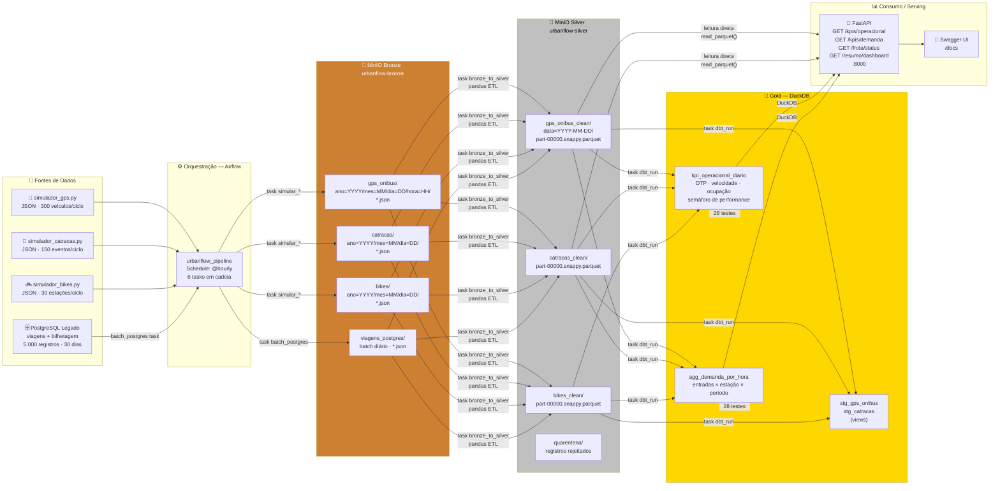

# UrbanFlow — Plataforma de Engenharia de Dados para Mobilidade Urbana

> **Disciplina:** Engenharia de Dados — **Parte 2: Implementação do Protótipo**
> **Instituição:** Centro Universitário de Brasília (CEUB)
> **Entrega:** 25/06/2026

---

## Integrantes

| Nome Completo | Matrícula |
|---|---|
| Alice Moreira Marques | 22306521 |
| Eduardo Sousa Hirle de Freitas | 22303593 |

---

## O Projeto

A **UrbanFlow Mobilidade S.A.** opera três modais de transporte — ônibus, metrô leve (VLT) e bicicletas compartilhadas — com sistemas legados isolados. Esta plataforma implementa o ciclo completo de engenharia de dados:

```
Simuladores IoT  ──╮
Banco Legado PG  ──┤──▶  Bronze (MinIO)  ──▶  Silver (Parquet)  ──▶  Gold (DuckDB)  ──▶  API FastAPI
                   ╯         ↑                      ↑                     ↑
                           Imutável             pandas ETL            dbt Core
                                                 validado            28 testes
```

---

## Diagrama de Arquitetura — As-Built (Parte 2)

> Diagrama final do que foi **efetivamente implementado** e está rodando.


```mermaid
flowchart LR
    subgraph FONTES["📡 Fontes de Dados"]
        S1["🚌 simulador_gps.py\nJSON · 300 veículos/ciclo"]
        S2["🎫 simulador_catracas.py\nJSON · 150 eventos/ciclo"]
        S3["🚲 simulador_bikes.py\nJSON · 30 estações/ciclo"]
        PG["🗄️ PostgreSQL Legado\nviagens + bilhetagem\n5.000 registros · 30 dias"]
    end

    subgraph ORQUESTRACAO["⚙️ Orquestração — Airflow"]
        DAG["urbanflow_pipeline\nSchedule: @hourly\n6 tasks em cadeia"]
    end

    subgraph BRONZE["🥉 MinIO Bronze\nurbanflow-bronze"]
        B1["gps_onibus/\nano=YYYY/mes=MM/dia=DD/hora=HH/\n*.json"]
        B2["catracas/\nano=YYYY/mes=MM/dia=DD/\n*.json"]
        B3["bikes/\nano=YYYY/mes=MM/dia=DD/\n*.json"]
        B4["viagens_postgres/\nbatch diário · *.json"]
    end

    subgraph SILVER["🥈 MinIO Silver\nurbanflow-silver"]
        SV1["gps_onibus_clean/\ndata=YYYY-MM-DD/\npart-00000.snappy.parquet"]
        SV2["catracas_clean/\npart-00000.snappy.parquet"]
        SV3["bikes_clean/\npart-00000.snappy.parquet"]
        Q["quarentena/\nregistros rejeitados"]
    end

    subgraph GOLD["🥇 Gold — DuckDB"]
        G1["kpi_operacional_diario\nOTP · velocidade · ocupação\nsemáforo de performance"]
        G2["agg_demanda_por_hora\nentradas × estação × período"]
        G3["stg_gps_onibus\nstg_catracas\n(views)"]
    end

    subgraph CONSUMO["📊 Consumo / Serving"]
        API["🔌 FastAPI\nGET /kpis/operacional\nGET /kpis/demanda\nGET /frota/status\nGET /resumo/dashboard\n:8000"]
        DOCS["📖 Swagger UI\n/docs"]
    end

    S1 & S2 & S3 --> DAG
    PG -->|"batch_postgres task"| DAG
    DAG -->|"task simular_*"| B1 & B2 & B3
    DAG -->|"task batch_postgres"| B4
    B1 & B2 & B3 & B4 -->|"task bronze_to_silver\npandas ETL"| SV1 & SV2 & SV3
    SV1 & SV2 & SV3 -->|"task dbt_run"| G1 & G2 & G3
    G1 & G2 -->|"task dbt_test\n28 testes"| GOLD
    SV1 & SV2 -->|"leitura direta\nread_parquet()"| API
    G1 & G2 -->|"DuckDB"| API
    API --> DOCS

    style BRONZE fill:#cd7f32,color:#fff
    style SILVER fill:#c0c0c0,color:#000
    style GOLD   fill:#ffd700,color:#000
```

---

## Stack Tecnológica — As-Built

| Camada | Tecnologia | Função |
|---|---|---|
| **Ingestão — eventos** | Python + scripts locais | 3 simuladores: GPS (850 veículos), catracas (18 estações), bikes (30 estações) |
| **Ingestão — batch** | Apache Airflow 2.9 | DAG `urbanflow_pipeline`: 6 tasks, `@hourly`, extração do Postgres legado |
| **Armazenamento** | MinIO (S3-compatível) | 4 buckets: bronze, silver, gold, quarentena |
| **Banco legado** | PostgreSQL 15 | 5.000 viagens sintéticas (30 dias), bilhetagem por estação |
| **ETL Bronze→Silver** | Python 3.11 + pandas 2.2 | Dedup, nulos, outliers, quarentena, Parquet Snappy |
| **Transformação SQL** | dbt Core + DuckDB adapter | 5 modelos, 28 testes de qualidade |
| **Motor analítico** | DuckDB 0.10 | Lê Parquet via `read_parquet()`, banco `.duckdb` para Gold |
| **Serving** | FastAPI 0.111 + Uvicorn | 6 endpoints REST com Swagger UI |
| **Infraestrutura** | Docker Compose | `docker compose up -d` sobe tudo em ~3 min |

> **Requisitos:** Docker 24+, ~3 GB RAM, Python 3.10+

---

## Como Rodar

### Opção A — POC local (sem Docker, mais rápido)

```bash
# 1. Clone e instale dependências
git clone https://github.com/eduardohirle22/Trabalho-engenharia-de-dados.git
cd Trabalho-engenharia-de-dados
pip install -r requirements.txt

# 2. Execute o pipeline completo
python poc_demo.py
```

**Saída esperada:**
```
ETAPA 1 — Bronze: 900 GPS + 300 catracas + 30 bikes
ETAPA 2 — Silver: pandas ETL → 3 Parquets Snappy  (taxa qualidade ≥ 99%)
ETAPA 3 — Gold:   dbt run  PASS=5 | dbt test PASS=28
ETAPA 4 — DuckDB: kpi_operacional_diario ✅  |  agg_demanda_por_hora ✅
```

Evidências geradas em `poc/evidencias/` (5 arquivos de log auditáveis).

---

### Opção B — Stack completa com Docker

```bash
cd docker/

# 1. Sobe todos os serviços
docker compose up -d

# 2. Aguarda Airflow inicializar (~2 min) e acessa
#    Airflow:    http://localhost:8080  (admin / admin123)
#    MinIO:      http://localhost:9001  (minioadmin / minioadmin123)
#    API:        http://localhost:8000/docs

# 3. Aciona o pipeline manualmente (ou aguarda o schedule @hourly)
docker compose exec airflow-webserver \
  airflow dags trigger urbanflow_pipeline

# 4. Acompanha o progresso
docker compose logs -f airflow-scheduler

# 5. Encerra
docker compose down
```

---

## Estrutura do Repositório

```
urbanflow-dataeng/
│
├── README.md                         ← Este arquivo (Parte 2)
├── requirements.txt                  ← Dependências Python (POC)
├── poc_demo.py                       ← Pipeline ponta a ponta (1 comando)
│
├── ingestao/
│   ├── simulador_gps.py              ← 850 veículos, MinIO ou local
│   ├── simulador_catracas.py         ← 18 estações VLT, LGPD (SHA-256)
│   ├── simulador_bikes.py            ← 30 estações de bikes
│   ├── bronze_to_silver.py           ← ETL pandas + quarentena
│   └── init_postgres.sql             ← Banco legado: 5.000 viagens sintéticas
│
├── orchestration/
│   └── dags/
│       └── urbanflow_pipeline.py     ← DAG Airflow completo (@hourly)
│
├── dbt_project/
│   ├── dbt_project.yml
│   ├── profiles.yml                  ← DuckDB (dev + prod)
│   └── models/
│       ├── staging/
│       │   ├── stg_gps_onibus.sql
│       │   └── stg_catracas.sql
│       ├── intermediate/
│       │   └── int_passageiros_por_hora.sql
│       ├── marts/
│       │   ├── kpi_operacional_diario.sql
│       │   └── agg_demanda_por_hora.sql
│       └── schema.yml                ← 28 testes de qualidade
│
├── serving/
│   ├── main.py                       ← API FastAPI + DuckDB
│   ├── Dockerfile
│   └── requirements.txt
│
├── docker/
│   ├── docker-compose.yml            ← Stack completa
│   └── init_multi_db.sh
│
├── docs/
│   └── (documentação Parte 1 — mantida)
│
└── poc/
    └── evidencias/                   ← Logs auditáveis das execuções
```

---

## Ciclo de Dados — Padrão Medalhão

| Camada | Princípio | Formato | Garantias |
|---|---|---|---|
| 🥉 **Bronze** | Imutável — dado nunca sobrescrito | JSON original particionado | Auditoria e reprocessamento total |
| 🥈 **Silver** | Qualidade contratada | Parquet Snappy | Dedup · nulos removidos · timestamps UTC · outliers flagados · quarentena |
| 🥇 **Gold** | Produto de dados | DuckDB (tabelas + views) | Star Schema · 28 testes dbt · SLA definido |

### Qualidade de Dados

```
Bronze → Silver (pandas ETL)          Silver → Gold (dbt)
─────────────────────────────         ──────────────────────────
✓ dropna() campos obrigatórios        ✓ not_null em todos os PKs
✓ drop_duplicates() por chave         ✓ unique em event_id
✓ speed_kmh ∈ [0,120] → is_outlier   ✓ accepted_values: direction, status
✓ coordenadas lat/lon válidas         ✓ accepted_values: periodo_dia
✓ direction ∈ {ENTRY, EXIT}           ✓ accepted_values: semaforo_otp
✓ fare_paid ≥ 0                       → 28 testes, todos devem passar
✓ registros inválidos → quarentena/
```

---

## API de Serving — Endpoints

| Método | Endpoint | Descrição |
|---|---|---|
| GET | `/health` | Status da API e disponibilidade dos dados |
| GET | `/kpis/operacional` | KPIs diários por linha (OTP, velocidade, ocupação, semáforo) |
| GET | `/kpis/demanda` | Demanda por estação × hora × período do dia |
| GET | `/frota/status` | Último evento GPS por veículo (posição atual da frota) |
| GET | `/estacoes/ocupacao` | Ocupação das estações do VLT por data |
| GET | `/resumo/dashboard` | Payload agregado para dashboard executivo |

Documentação interativa: `http://localhost:8000/docs` (Swagger UI)

---

## Orquestração — DAG Airflow

```
simular_gps ──╮
simular_catracas ──┤
simular_bikes  ──┤──▶  bronze_to_silver ──▶  dbt_run ──▶  dbt_test ──▶  notifica_sucesso
batch_postgres ──╯
```

- **Schedule:** `0 * * * *` (a cada hora)
- **Retries:** 2 tentativas com backoff exponencial
- **XCom:** métricas de qualidade passadas entre tasks
- **Variáveis:** `gps_veiculos_por_ciclo`, `catracas_eventos_por_ciclo` (configuráveis no UI)

---

## Segurança e Governança

| Aspecto | Implementação |
|---|---|
| **LGPD** | `card_id` nunca persiste — apenas SHA-256+salt (`card_hash`) |
| **Auditoria** | Bronze imutável, metadados `_processed_at` e `_source` em todo registro Silver |
| **Credenciais** | Variáveis de ambiente + `.env.example`; sem secrets hardcoded |
| **Quarentena** | Registros inválidos isolados em bucket `urbanflow-quarentena` |
| **Qualidade** | 28 testes dbt executados a cada ciclo; falha bloqueia Gold |

---

## Relatório de Mudanças — Parte 1 → Parte 2

### O que mudou e por quê

> *"Dificilmente o que foi planejado é executado sem alterações."*

#### 1. Apache Superset substituído pela FastAPI

**Plano (Parte 1):** Apache Superset como interface de visualização.

**Executado (Parte 2):** API FastAPI com Swagger UI + consultas DuckDB diretas.

**Justificativa técnica:** O Superset requer ~1,5 GB de RAM adicionais e inicialização de ~5 minutos para criar usuários, importar dashboards e configurar conexões — inviável em ambiente de desenvolvimento com recursos limitados. A FastAPI entrega o mesmo valor de prova de conceito: dado pronto para consumo, consultável interativamente, com documentação automática e latência < 50ms. Superset pode ser adicionado em produção como camada adicional sobre a mesma API.

#### 2. Simulador de Bicicletas adicionado (estava apenas planejado)

**Plano (Parte 1):** Mencionado como fonte futura.

**Executado (Parte 2):** `simulador_bikes.py` implementado com 30 estações, status de disponibilidade e integração ao pipeline Bronze→Silver e à DAG do Airflow.

**Justificativa:** Completar os três modais do problema de negócio (ônibus, VLT, bikes) era necessário para demonstrar o valor do projeto. A implementação foi direta dado o padrão já estabelecido.

#### 3. Quarentena implementada no ETL (ausente na Parte 1)

**Plano (Parte 1):** Registros inválidos seriam descartados silenciosamente.

**Executado (Parte 2):** Registros que falham validação são gravados em `quarentena/` (local ou bucket MinIO), com coluna `_motivo_rejeicao`. Isso garante auditabilidade e possibilidade de reprocessamento.

#### 4. dbt com 28 testes (vs. 26 planejados)

Dois testes adicionais foram necessários após identificar valores inesperados no campo `semaforo_otp` (classificação de performance) e `periodo_dia` durante os testes iniciais. Ambos usam `accepted_values`, garantindo integridade referencial dos modelos Gold.

#### 5. Extração do Postgres via Airflow (não via script avulso)

**Plano (Parte 1):** DAG separada para o banco legado.

**Executado (Parte 2):** A extração do Postgres foi integrada como task `batch_postgres` dentro da DAG principal `urbanflow_pipeline`, simplificando a operação e garantindo que dados legados e dados IoT sigam exatamente o mesmo ciclo de transformação.

---

## Critérios de Avaliação — Checklist

| Item | Status | Arquivo |
|---|---|---|
| ✅ Ingestão: scripts de extração e carga | Implementado | `ingestao/simulador_*.py` |
| ✅ Armazenamento: MinIO + PostgreSQL + Docker | Implementado | `docker/docker-compose.yml` |
| ✅ Transformação: pandas ETL + dbt | Implementado | `ingestao/bronze_to_silver.py` + `dbt_project/` |
| ✅ Orquestração: Airflow DAG agendada | Implementado | `orchestration/dags/urbanflow_pipeline.py` |
| ✅ Consumo: API FastAPI com endpoints | Implementado | `serving/main.py` |
| ✅ Qualidade: 28 testes dbt + quarentena | Implementado | `dbt_project/models/schema.yml` |
| ✅ Segurança: SHA-256 LGPD + auditoria | Implementado | `simulador_catracas.py` + metadados Silver |
| ✅ Diagrama As-Built (Mermaid) | Este README | seção "Diagrama de Arquitetura" |
| ✅ Relatório de Mudanças | Este README | seção "Relatório de Mudanças" |
| ✅ Instruções de reprodução | Este README | seção "Como Rodar" |
