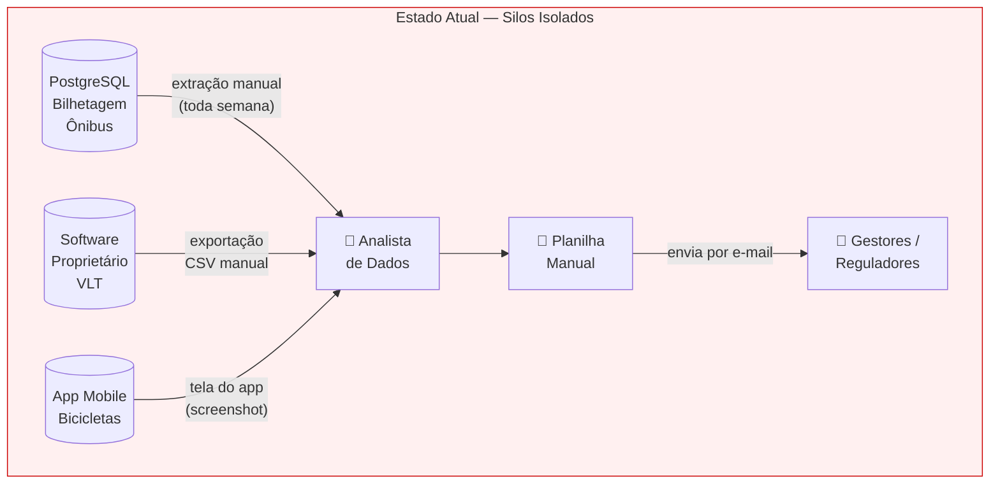
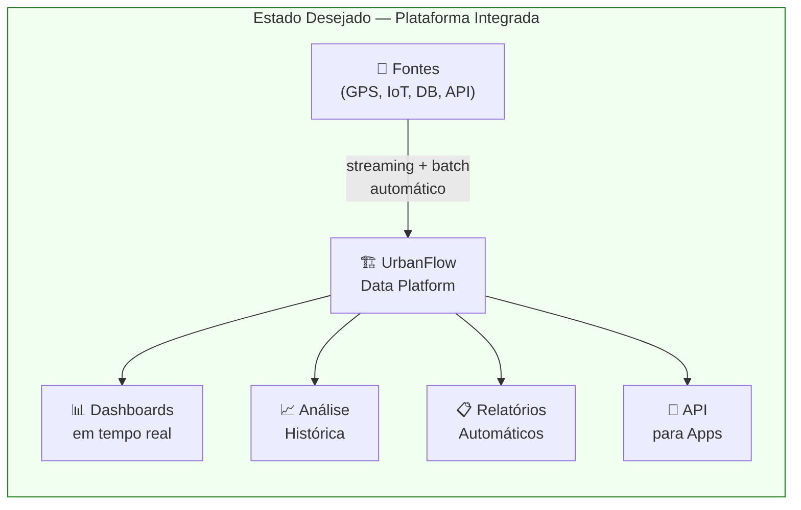
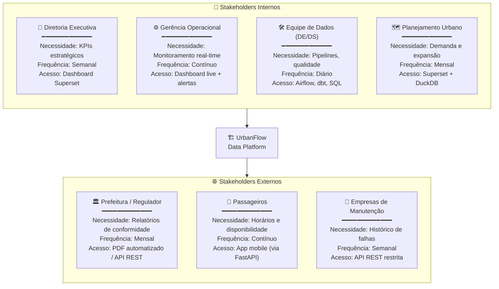

# 1. Descrição do Projeto

## 1.1 Nome e Contexto de Negócio

**Nome do Projeto:** UrbanFlow — Data Platform para Mobilidade Urbana

**Contexto:** Uma empresa fictícia chamada **UrbanFlow Mobilidade S.A.** opera três modais de transporte em uma cidade de médio porte (≈ 800 mil habitantes):

- 🚌 **Ônibus urbanos** — 120 linhas, 850 veículos com rastreamento GPS
- 🚇 **Metrô leve (VLT)** — 2 linhas, 18 estações, catracas eletrônicas
- 🚲 **Bicicletas compartilhadas** — 80 estações, 600 bicicletas com IoT embarcado

Atualmente, cada modal possui seus próprios sistemas legados **completamente isolados** entre si: o sistema de ônibus roda num PostgreSQL legado gerenciado pela área de TI, o VLT usa um software proprietário de controle de acesso, e as bicicletas têm um aplicativo mobile próprio que não exporta dados estruturados. Não existe nenhuma camada de integração, e a equipe de dados passa a maior parte do tempo extraindo planilhas manualmente de cada sistema.

O projeto UrbanFlow nasce para **quebrar esses silos**, construindo uma plataforma de dados moderna, observável e escalável que suporte tanto a operação em tempo real quanto análises históricas e estratégicas.

---

## 1.2 Problema que o Projeto Pretende Resolver

### Situação Atual ("AS-IS")

### Problemas Identificados

| # | Problema | Causa Raiz | Impacto no Negócio |
|---|---|---|---|
| P1 | **Silos de dados** — cada modal tem seu banco isolado | Sistemas legados sem API de integração | Impossível analisar padrões de integração intermodal; passageiro que usa bike + ônibus é invisível |
| P2 | **Ausência de monitoramento em tempo real** — gestores visualizam apenas dados do dia anterior (T-1) | Nenhum pipeline de streaming existe | Incidentes são descobertos pelos passageiros antes da operação; impossível reagir a atrasos em tempo hábil |
| P3 | **Relatórios manuais para reguladores** — equipe gasta 3+ dias/mês compilando planilhas | Nenhuma automação de relatório | Risco de erros humanos, atrasos e multas contratuais; low scalability |
| P4 | **Dimensionamento de frota intuitivo** — sem análise de demanda histórica | Ausência de dados analíticos consolidados | Superlotação nos horários de pico, frota ociosa nos horários vazios; custo operacional elevado |
| P5 | **Qualidade de dados não monitorada** — campos nulos, duplicatas e outliers passam despercebidos | Sem pipeline de validação ou contratos de dados | Relatórios incorretos, métricas de KPI distorcidas, perda de confiança nos dados |

### Situação Desejada ("TO-BE")

### Objetivos Principais (mensuráveis)

| # | Objetivo | Métrica de Sucesso |
|---|---|---|
| O1 | **Integrar** todos os modais em plataforma única | 100% das fontes ingeridas automaticamente |
| O2 | **Monitoramento em tempo real** de frotas e passageiros | Latência end-to-end < 30 segundos |
| O3 | **Automatizar relatórios regulatórios** | Relatório gerado em < 5 minutos (vs. 3 dias manual) |
| O4 | **Análise histórica** de demanda por linha/horário/região | 12 meses de histórico disponíveis para análise |
| O5 | **Base de dados curada** para modelos preditivos | Tabelas Gold validadas com > 99% de completude |

---

## 1.3 Principais Stakeholders e Usuários Finais dos Dados

### Perfis Detalhados dos Usuários de Dados

| Perfil | Necessidade Principal | Tipo de Dado Consumido | Interface de Acesso | SLA Esperado |
|---|---|---|---|---|
| **Analista de Dados** | Exploração ad-hoc e criação de relatórios | Camada Gold (DuckDB) | SQL via DuckDB CLI / Jupyter | Disponibilidade T+1 |
| **Engenheiro de Dados** | Construção, manutenção e monitoramento de pipelines | Metadados, logs, qualidade | Airflow UI / dbt CLI / Grafana | Alertas em tempo real |
| **Gestor Operacional** | Visão em tempo real da frota e passageiros | Streaming Silver / Gold | Dashboard Superset (live) | Latência < 30s |
| **Regulador Municipal** | Indicadores mensais de qualidade de serviço | Gold — tabelas regulatórias | PDF gerado automaticamente / API | Relatório até dia 5 de cada mês |
| **Cientista de Dados** | Feature store para modelos de previsão de demanda | Gold curado e validado | DuckDB / Parquet direto | Dados completos e sem anomalias |
| **Passageiro (indireto)** | Consulta de horários e disponibilidade de bikes | Gold — dados de disponibilidade | App mobile via FastAPI | < 200ms por requisição |
