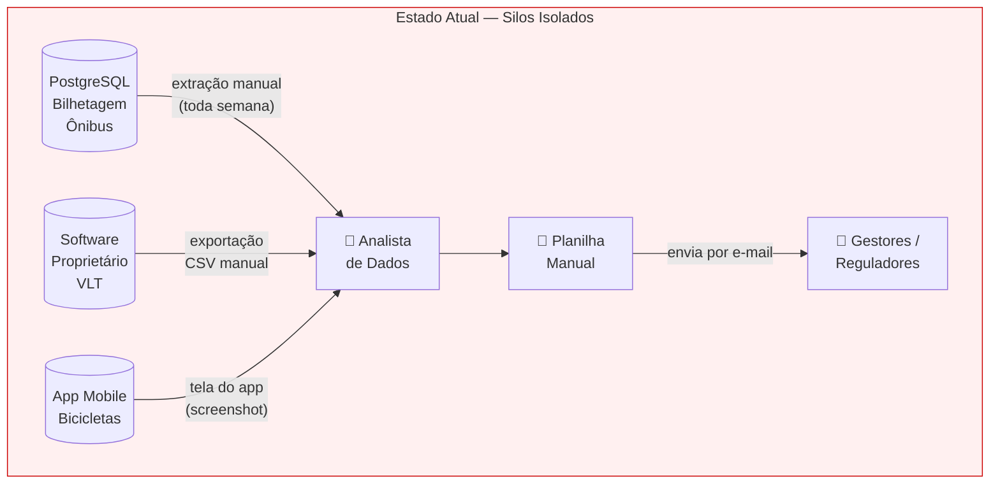
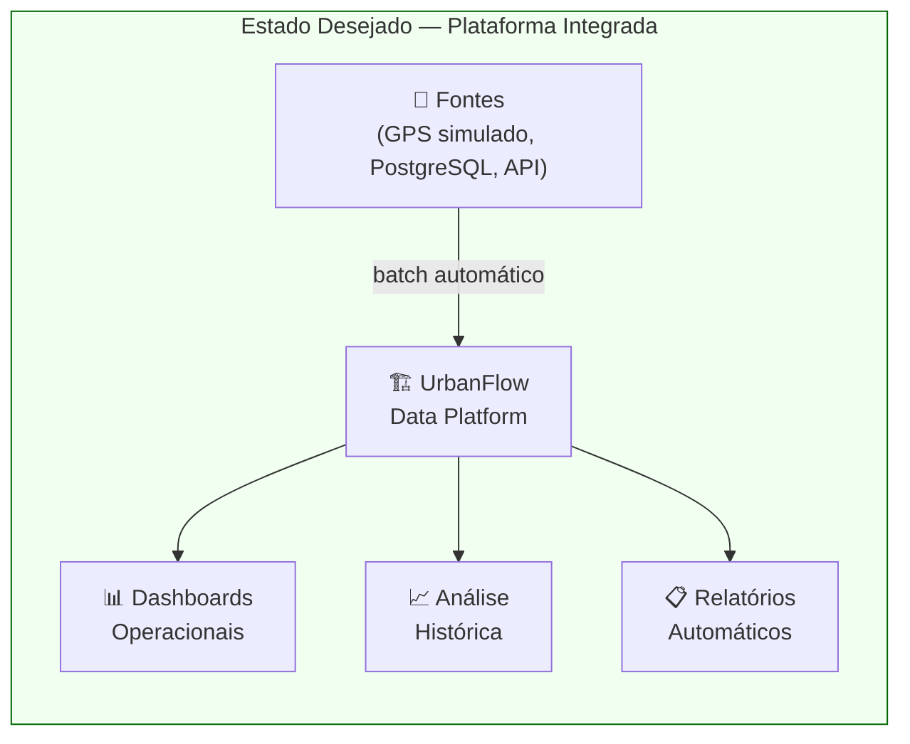

# 1. Descrição do Projeto

## 1.1 Nome e Contexto de Negócio

**Nome do Projeto:** UrbanFlow — Plataforma de Dados para Mobilidade Urbana

**Contexto:** Uma empresa fictícia chamada **UrbanFlow Mobilidade S.A.** opera três modais de transporte em uma cidade de médio porte (≈ 800 mil habitantes):

- 🚌 **Ônibus urbanos** — 120 linhas, 850 veículos com rastreamento GPS
- 🚇 **Metrô leve (VLT)** — 2 linhas, 18 estações, catracas eletrônicas
- 🚲 **Bicicletas compartilhadas** — 80 estações, 600 bicicletas com IoT embarcado

Atualmente, cada modal possui sistemas legados **completamente isolados**: o sistema de ônibus roda num PostgreSQL gerenciado pela área de TI, o VLT usa um software proprietário de controle de acesso, e as bicicletas têm um aplicativo mobile próprio que não exporta dados estruturados. Não existe nenhuma camada de integração, e a equipe de dados passa a maior parte do tempo extraindo planilhas manualmente de cada sistema.

O projeto UrbanFlow nasce para **quebrar esses silos**, construindo uma plataforma de dados moderna e observável que suporte tanto análises históricas quanto monitoramento operacional.

---

## 1.2 Problema que o Projeto Pretende Resolver

### Situação Atual ("AS-IS")

### Problemas Identificados

| # | Problema | Causa Raiz | Impacto no Negócio |
|---|---|---|---|
| P1 | **Silos de dados** — cada modal tem seu banco isolado | Sistemas legados sem integração | Impossível analisar padrões intermodais |
| P2 | **Sem monitoramento operacional** — gestores veem apenas dados do dia anterior | Nenhum pipeline automatizado | Incidentes descobertos pelos passageiros antes da operação |
| P3 | **Relatórios manuais** — equipe gasta 3+ dias/mês compilando planilhas | Sem automação | Risco de erros humanos e multas contratuais |
| P4 | **Dimensionamento de frota intuitivo** — sem análise de demanda histórica | Sem dados analíticos consolidados | Superlotação nos picos, frota ociosa nos horários vazios |

### Situação Desejada ("TO-BE")

### Objetivos Principais

| # | Objetivo | Métrica de Sucesso |
|---|---|---|
| O1 | **Integrar** todos os modais em plataforma única | 100% das fontes ingeridas automaticamente |
| O2 | **Automatizar relatórios regulatórios** | Relatório gerado em < 5 minutos (vs. 3 dias manual) |
| O3 | **Análise histórica** de demanda por linha/horário | 12 meses de histórico disponíveis para análise |
| O4 | **Base de dados curada** para consultas analíticas | Tabelas Gold validadas com > 99% de completude |

---

## 1.3 Principais Stakeholders e Usuários Finais dos Dados

| Perfil | Necessidade Principal | Interface de Acesso | SLA Esperado |
|---|---|---|---|
| **Analista de Dados** | Exploração ad-hoc e criação de relatórios | SQL via DuckDB / Jupyter | Dados disponíveis até 06h00 |
| **Engenheiro de Dados** | Manutenção e monitoramento de pipelines | Airflow UI / dbt CLI | Alertas em caso de falha |
| **Gestor Operacional** | KPIs diários de frota e passageiros | Dashboard Superset | Dados do dia anterior até 06h00 |
| **Regulador Municipal** | Indicadores mensais de qualidade de serviço | PDF gerado automaticamente | Relatório até dia 5 de cada mês |
| **Planejamento Urbano** | Análise de demanda por região e horário | Superset + DuckDB | Dados históricos consolidados |