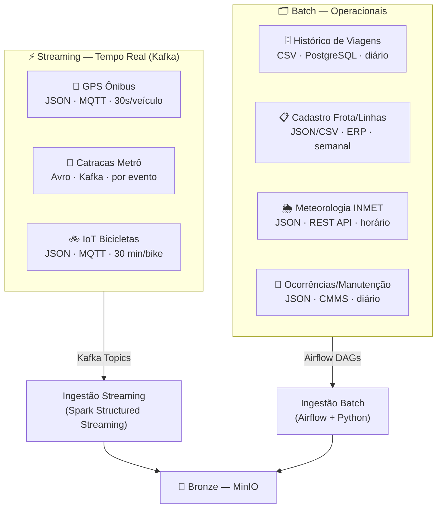

# 2. Definição e Classificação dos Dados

## 2.1 Visão Geral — Mapa de Fontes de Dados

O projeto UrbanFlow utiliza **7 fontes de dados** organizadas em dois grandes grupos: **streaming** (eventos contínuos que exigem processamento com baixa latência) e **operacionais/batch** (dados transacionais, históricos e de referência processados em lotes periódicos).



---

## 2.2 Dados de Streaming (Tempo Real)

Estes dados são gerados de forma contínua por dispositivos físicos embarcados nos veículos e estruturas. Por sua natureza de alta frequência e baixa latência, são transportados via **Apache Kafka** e processados com **Spark Structured Streaming**.

---

### 2.2.1 Telemetria GPS dos Ônibus

| Atributo | Detalhe |
|---|---|
| **Origem** | Dispositivos GPS/GSM embarcados nos 850 ônibus (protocolo MQTT) |
| **Intermediário** | Bridge MQTT → Kafka via **Kafka Connect MQTT Source Connector** |
| **Tópico Kafka** | `gps-onibus` (4 partições) |
| **Formato** | JSON |
| **Volume estimado** | ~850 msgs/min em operação normal; ~2.550 msgs/min no pico |
| **Frequência de emissão** | A cada **30 segundos** por veículo ativo |
| **Janela de operação** | 05h00–00h00 (19h/dia) |
| **Latência esperada** | < 5 segundos (dispositivo → tópico Kafka) |
| **Retenção no Kafka** | 24 horas |

**Schema do evento (JSON):**

```json
{
  "vehicle_id":     "BUS-0423",
  "line_id":        "L042",
  "direction":      "IDA",
  "lat":            -23.5505,
  "lon":            -46.6333,
  "speed_kmh":      32.5,
  "heading_deg":    215,
  "occupancy_pct":  78,
  "engine_on":      true,
  "door_open":      false,
  "status":         "on_route",
  "timestamp":      "2026-04-09T08:14:30Z",
  "schema_version": "1.2"
}
```

---

### 2.2.2 Eventos de Catracas do Metrô/VLT

| Atributo | Detalhe |
|---|---|
| **Origem** | Catracas eletrônicas nas 18 estações (72 catracas no total) |
| **Formato** | **Avro** com Schema Registry (garante evolução de schema com compatibilidade backward) |
| **Tópico Kafka** | `catracas-metro` (2 partições) |
| **Volume estimado** | ~15.000 eventos/hora no pico; ~3.000/hora nos demais horários |
| **Latência esperada** | < 2 segundos |
| **Retenção no Kafka** | 24 horas |

**Schema Avro (resumido):**

```json
{
  "type": "record",
  "name": "GateEvent",
  "fields": [
    {"name": "event_id",    "type": "string"},
    {"name": "gate_id",     "type": "string"},
    {"name": "station_id",  "type": "string"},
    {"name": "direction",   "type": {"type": "enum", "symbols": ["ENTRY", "EXIT"]}},
    {"name": "card_type",   "type": {"type": "enum", "symbols": ["SINGLE", "MONTHLY", "STUDENT", "SENIOR"]}},
    {"name": "card_hash",   "type": "string"},
    {"name": "fare_paid",   "type": "float"},
    {"name": "timestamp",   "type": "long", "logicalType": "timestamp-millis"}
  ]
}
```

> ⚠️ **Privacidade:** O `card_id` original é substituído por `card_hash` (SHA-256) já na publicação Kafka, garantindo pseudoanonimização antes do armazenamento.

---

### 2.2.3 Sensores IoT das Bicicletas Compartilhadas

| Atributo | Detalhe |
|---|---|
| **Origem** | Sensor embarcado em cada bicicleta (600 unidades) — GPS + acelerômetro + sensor de trava |
| **Intermediário** | MQTT → Kafka Connect |
| **Tópico Kafka** | `bikes-iot` (2 partições) |
| **Formato** | JSON |
| **Volume estimado** | ~1.200 msgs/hora durante o dia; heartbeat a cada 2h quando ociosa |
| **Frequência** | A cada 30 min quando em uso; heartbeat de disponibilidade a cada 2h |
| **Latência esperada** | < 10 segundos |

**Schema do evento:**

```json
{
  "bike_id":     "BIKE-0187",
  "station_id":  "ST-042",
  "status":      "in_use",
  "lat":         -23.5612,
  "lon":         -46.6441,
  "battery_pct": 67,
  "lock_status": "unlocked",
  "trip_id":     "TRIP-20260409-0187-001",
  "timestamp":   "2026-04-09T09:32:00Z"
}
```

---

## 2.3 Dados Operacionais (Batch)

Dados extraídos periodicamente de sistemas legados, bancos relacionais e APIs externas, processados em lotes agendados pelo **Apache Airflow**.

---

### 2.3.1 Registros de Viagens (Histórico)

| Atributo | Detalhe |
|---|---|
| **Origem** | Banco **PostgreSQL** legado do sistema de bilhetagem |
| **Mecanismo** | Consulta JDBC incremental via **Airflow PostgresHook** (filtro por `trip_date = T-1`) |
| **Formato de saída** | CSV comprimido com gzip |
| **Volume estimado** | ~120.000 registros/dia · ~15 MB/dia (~4 MB comprimido) |
| **Frequência** | Extração diária às **01h00** |
| **Latência** | Dados de T-1 (dia anterior) |

**Schema da tabela fonte:**

```sql
CREATE TABLE trips (
    trip_id        UUID         PRIMARY KEY,
    modal          VARCHAR(20)  NOT NULL,   -- 'onibus', 'metro', 'bicicleta'
    origin_stop_id VARCHAR(20),
    dest_stop_id   VARCHAR(20),
    card_hash      VARCHAR(64),
    fare_paid      DECIMAL(6,2),
    trip_date      DATE         NOT NULL,
    departure_ts   TIMESTAMP,
    arrival_ts     TIMESTAMP,
    duration_min   SMALLINT,
    vehicle_id     VARCHAR(20),
    created_at     TIMESTAMP    DEFAULT NOW()
);
```

---

### 2.3.2 Cadastro de Frota e Linhas

| Atributo | Detalhe |
|---|---|
| **Origem** | ERP interno — módulo de gestão de frota |
| **Formato** | JSON (linhas) + CSV (veículos) |
| **Volume** | ~1.500 registros de veículos + ~120 definições de linhas |
| **Frequência** | Semanal (segunda-feira às 06h00) |
| **Uso** | Tabela de dimensão — enriquece dados de GPS e viagens com nome da linha, capacidade, tipo de veículo |

---

### 2.3.3 Dados Meteorológicos (API INMET)

| Atributo | Detalhe |
|---|---|
| **Origem** | API pública do INMET — `/estacao/dados/{codigo_estacao}` |
| **Formato** | JSON via REST |
| **Frequência de coleta** | A cada **1 hora** |
| **Latência** | ~1 hora (dados da última hora completa) |
| **Uso** | Enriquecimento: correlacionar precipitação/temperatura com demanda de transporte e atrasos |

> **Justificativa de inclusão:** Precipitação reduz o uso de bicicletas compartilhadas em ~40% e aumenta o tempo de viagem dos ônibus em até 25% (tráfego). Esses dados são essenciais para análises de demanda contextualizada.

---

### 2.3.4 Ocorrências e Manutenção (CMMS)

| Atributo | Detalhe |
|---|---|
| **Origem** | Sistema CMMS de gestão de manutenção — exportação JSON diária |
| **Volume** | ~200 registros/dia |
| **Frequência** | Diário às 02h00 |
| **Uso** | Correlacionar falhas com atrasos nas linhas; calcular MTBF; alimentar alertas de manutenção preventiva |

---

## 2.4 Classificação Explícita e Comparativo

### Streaming vs. Batch — Diferenças Fundamentais

| Dimensão | Dados de Streaming | Dados Operacionais (Batch) |
|---|---|---|
| **Frequência** | Contínuo (segundos a minutos) | Periódico (horário, diário, semanal) |
| **Latência tolerada** | Segundos (< 30s) | Horas a dias (T-1 aceitável) |
| **Volume por evento** | Pequeno (< 1 KB por msg) | Grande (CSV com milhares de linhas) |
| **Padrão de entrega** | Push (dispositivo publica no broker) | Pull (pipeline busca na fonte) |
| **Tecnologia de transporte** | Apache Kafka (tópicos) | Airflow DAGs (JDBC, REST) |
| **Formato preferencial** | JSON / Avro | CSV / JSON |
| **Caso de uso principal** | Monitoramento operacional em tempo real | Análise histórica e relatórios |

### Tabela Resumo das 7 Fontes

| Fonte | Tipo | Formato | Frequência | Volume/dia | Latência | Destino Bronze |
|---|---|---|---|---|---|---|
| GPS Ônibus | **Streaming** | JSON | 30s/veículo | ~2,4M msgs | < 5s | `bronze/gps_onibus/` |
| Catracas Metrô | **Streaming** | Avro | Por evento | ~100K eventos | < 2s | `bronze/catracas/` |
| IoT Bicicletas | **Streaming** | JSON | 30min/bike | ~29K msgs | < 10s | `bronze/bikes_iot/` |
| Histórico Viagens | **Batch** | CSV | Diário 01h00 | ~120K linhas | T-1 | `bronze/viagens/` |
| Frota e Linhas | **Batch** | JSON/CSV | Semanal | ~1.500 linhas | D-7 | `bronze/frota/` |
| Meteorologia | **Batch** | JSON | Horário | ~288 linhas | ~1h | `bronze/clima/` |
| Manutenção | **Batch** | JSON | Diário 02h00 | ~200 linhas | T-1 | `bronze/manutencao/` |
