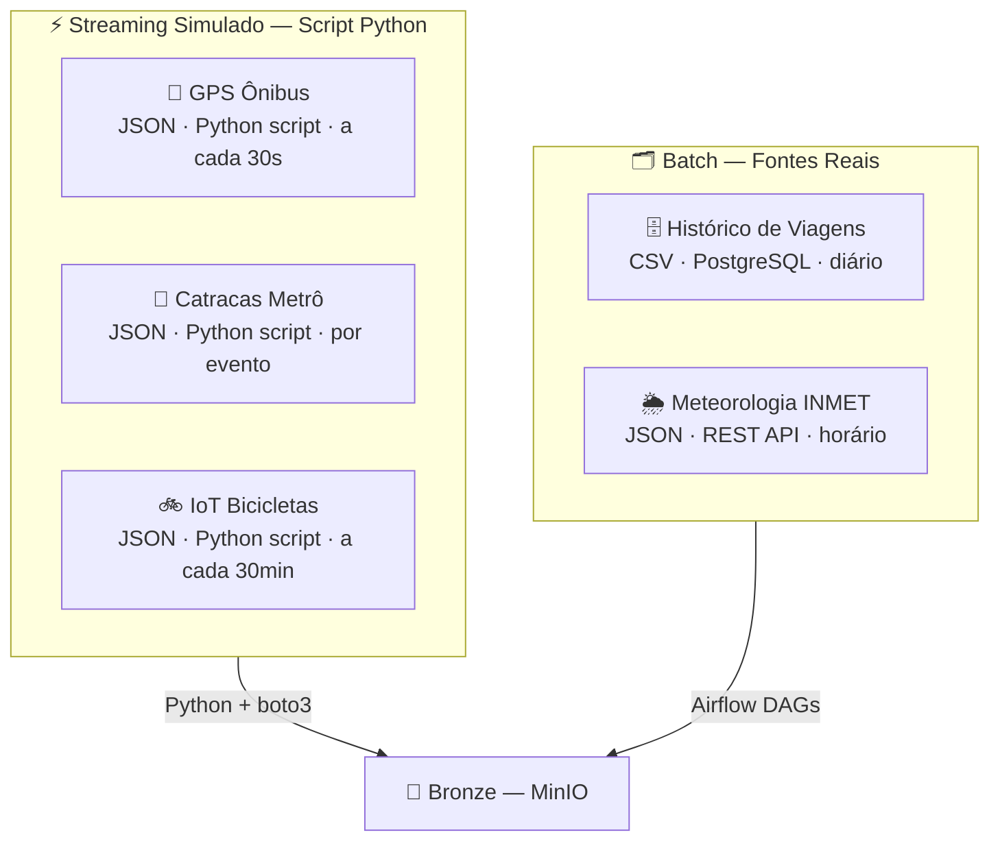

# 2. Definição e Classificação dos Dados

## 2.1 Visão Geral — Mapa de Fontes de Dados

O projeto UrbanFlow utiliza **5 fontes de dados** organizadas em dois grupos: **streaming simulado** (eventos contínuos gerados por script Python) e **batch** (dados extraídos periodicamente de sistemas e APIs).

> **Decisão de protótipo:** As fontes de streaming (GPS, catracas, bicicletas) são **simuladas por scripts Python** que geram eventos realistas e os publicam diretamente como arquivos JSON no MinIO. Essa abordagem elimina a necessidade de infraestrutura MQTT física, mas preserva todos os conceitos de ingestão de eventos e estrutura de dados. Na Parte 2, os scripts de simulação são parte integrante do projeto.



---

## 2.2 Dados de Streaming Simulado

Estes dados representam eventos contínuos gerados por dispositivos físicos nos veículos e estações. No protótipo, são **simulados por scripts Python** que publicam arquivos JSON particionados no MinIO, reproduzindo fielmente o comportamento e o volume de dados reais.

---

### 2.2.1 Telemetria GPS dos Ônibus

| Atributo | Detalhe |
|---|---|
| **Origem (produção)** | Dispositivos GPS/GSM embarcados nos 850 ônibus |
| **Origem (protótipo)** | Script Python `simulador_gps.py` rodando em loop |
| **Formato** | JSON |
| **Volume simulado** | ~850 eventos/ciclo · ~1 arquivo JSON por execução |
| **Frequência de geração** | A cada 30 segundos (simulado via `time.sleep(30)`) |
| **Destino** | `bronze/gps_onibus/ano=YYYY/mes=MM/dia=DD/hora=HH/` |

**Schema do evento:**

```json
{
  "vehicle_id":    "BUS-0423",
  "line_id":       "L042",
  "direction":     "IDA",
  "lat":           -23.5505,
  "lon":           -46.6333,
  "speed_kmh":     32.5,
  "occupancy_pct": 78,
  "status":        "on_route",
  "timestamp":     "2026-04-09T08:14:30Z"
}
```

---

### 2.2.2 Eventos de Catracas do Metrô/VLT

| Atributo | Detalhe |
|---|---|
| **Origem (produção)** | Catracas eletrônicas nas 18 estações |
| **Origem (protótipo)** | Script Python `simulador_catracas.py` |
| **Formato** | JSON |
| **Volume simulado** | ~500 eventos/hora no pico |
| **Destino** | `bronze/catracas/ano=YYYY/mes=MM/dia=DD/` |

**Schema do evento:**

```json
{
  "event_id":   "EVT-20260409-00123",
  "gate_id":    "GATE-EST05-02",
  "station_id": "EST-05",
  "direction":  "ENTRY",
  "card_type":  "MONTHLY",
  "card_hash":  "a3f9b2c1...",
  "fare_paid":  4.50,
  "timestamp":  "2026-04-09T08:15:02Z"
}
```

> ⚠️ **Privacidade:** O `card_id` original é substituído por `card_hash` (SHA-256) já no script simulador, antes do armazenamento.

---

### 2.2.3 Sensores IoT das Bicicletas Compartilhadas

| Atributo | Detalhe |
|---|---|
| **Origem (produção)** | Sensor embarcado em cada bicicleta (600 unidades) |
| **Origem (protótipo)** | Script Python `simulador_bikes.py` |
| **Formato** | JSON |
| **Volume simulado** | ~600 eventos/ciclo (uma linha por bicicleta) |
| **Frequência** | A cada 30 minutos quando em uso; heartbeat a cada 2h quando ociosa |
| **Destino** | `bronze/bikes_iot/ano=YYYY/mes=MM/dia=DD/` |

**Schema do evento:**

```json
{
  "bike_id":     "BIKE-0187",
  "station_id":  "ST-042",
  "status":      "in_use",
  "lat":         -23.5612,
  "lon":         -46.6441,
  "battery_pct": 67,
  "lock_status": "unlocked",
  "timestamp":   "2026-04-09T09:32:00Z"
}
```

---

## 2.3 Dados Operacionais (Batch)

Dados extraídos periodicamente de sistemas e APIs externas, processados em lotes agendados pelo **Apache Airflow**.

---

### 2.3.1 Registros de Viagens (Histórico)

| Atributo | Detalhe |
|---|---|
| **Origem** | Banco **PostgreSQL** que simula o sistema legado de bilhetagem |
| **Mecanismo** | Consulta SQL incremental via Airflow `PostgresHook` |
| **Formato** | CSV |
| **Volume estimado** | ~10.000 registros/dia (protótipo com dados gerados pelo Faker) |
| **Frequência** | Extração diária às **01h00** |
| **Destino** | `bronze/viagens/ano=YYYY/mes=MM/dia=DD/` |

**Schema da tabela fonte:**

```sql
CREATE TABLE trips (
    trip_id        VARCHAR(36)  PRIMARY KEY,
    modal          VARCHAR(20)  NOT NULL,  -- 'onibus', 'metro', 'bicicleta'
    line_id        VARCHAR(20),
    origin_stop_id VARCHAR(20),
    dest_stop_id   VARCHAR(20),
    card_hash      VARCHAR(64),
    fare_paid      DECIMAL(6,2),
    trip_date      DATE         NOT NULL,
    departure_ts   TIMESTAMP,
    arrival_ts     TIMESTAMP,
    duration_min   SMALLINT,
    vehicle_id     VARCHAR(20)
);
```

---

### 2.3.2 Dados Meteorológicos (API INMET)

| Atributo | Detalhe |
|---|---|
| **Origem** | API pública do INMET |
| **Formato** | JSON via REST |
| **Frequência de coleta** | A cada **1 hora** |
| **Destino** | `bronze/clima/ano=YYYY/mes=MM/dia=DD/hora=HH/` |
| **Uso** | Correlacionar precipitação com demanda de transporte e atrasos |

> **Justificativa:** Precipitação reduz o uso de bicicletas compartilhadas em ~40% e aumenta o tempo de viagem dos ônibus em até 25%. Esses dados enriquecem análises de demanda.

---

## 2.4 Classificação e Comparativo das Fontes

| Fonte | Tipo | Formato | Frequência | Volume/dia | Destino Bronze |
|---|---|---|---|---|---|
| GPS Ônibus | **Streaming simulado** | JSON | 30s/ciclo | ~2.900 arquivos | `bronze/gps_onibus/` |
| Catracas Metrô | **Streaming simulado** | JSON | Por evento | ~12.000 eventos | `bronze/catracas/` |
| IoT Bicicletas | **Streaming simulado** | JSON | 30min/ciclo | ~600 eventos | `bronze/bikes_iot/` |
| Histórico Viagens | **Batch** | CSV | Diário 01h00 | ~10.000 linhas | `bronze/viagens/` |
| Meteorologia | **Batch** | JSON | Horário | ~24 arquivos | `bronze/clima/` |

### Diferenças Conceituais: Streaming vs. Batch

| Dimensão | Streaming Simulado | Batch |
|---|---|---|
| **Frequência** | Contínuo (segundos a minutos) | Periódico (horário ou diário) |
| **Latência tolerada** | Minutos | Horas (T-1 aceitável) |
| **Padrão de entrega** | Push (script publica continuamente) | Pull (DAG busca na fonte) |
| **Tecnologia** | Script Python + boto3 | Airflow DAG + PostgresHook/HTTP |
| **Caso de uso** | Monitoramento operacional | Análise histórica e relatórios |