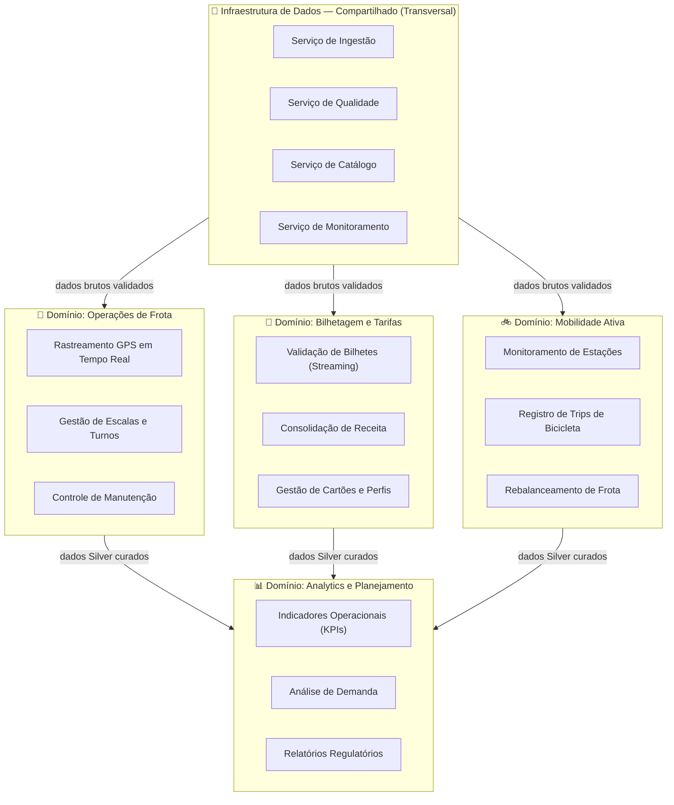
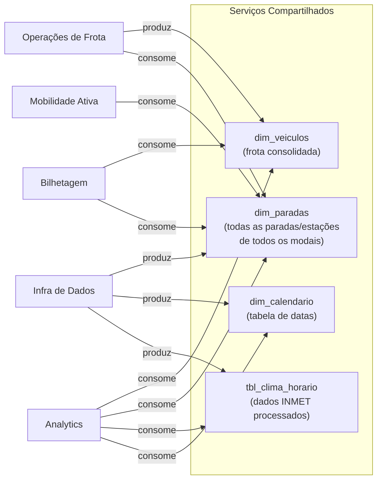
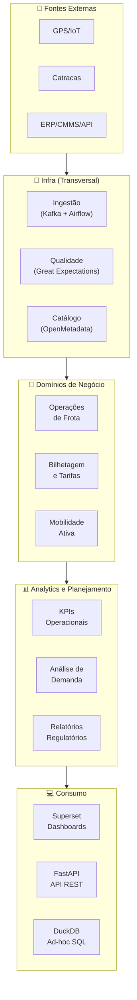

# 3. Domínios e Serviços

## 3.1 Abordagem: Domain-Driven Design aplicado à Engenharia de Dados

A organização dos dados e serviços do UrbanFlow segue os princípios do **Domain-Driven Design (DDD)**, adaptados para engenharia de dados. Cada **domínio** representa uma área de negócio coesa com **ownership claro** sobre seus dados, serviços e pipelines. Isso reduz o acoplamento entre áreas e facilita a evolução independente de cada parte do sistema.

O projeto identifica **5 domínios**, sendo 3 de negócio e 2 transversais.

---

## 3.2 Mapa Geral de Domínios

---

## 3.3 Detalhamento dos Domínios

### 3.3.1 Domínio: Operações de Frota 🚌

**Owner:** Gerência de Operações  
**Dados produzidos:** Posição atual de cada veículo, status (em rota / na parada / atrasado), velocidade, taxa de ocupação, histórico de manutenção.

| Serviço | Responsabilidade | Entrada | Saída |
|---|---|---|---|
| **Rastreamento GPS em Tempo Real** | Receber, validar e persistir posições GPS dos 850 ônibus; calcular atraso vs. horário previsto | Tópico Kafka `gps-onibus` | Silver: `gps_onibus_clean` · Alertas de atraso |
| **Gestão de Escalas e Turnos** | Manter grade horária das linhas e cruzar com dados reais de GPS | ERP (batch semanal) + GPS (streaming) | Tabela `dim_horarios` · OTP (On-Time Performance) |
| **Controle de Manutenção** | Registrar ocorrências, calcular MTBF, alertar veículos próximos de revisão | CMMS (batch diário) + GPS (status) | `dim_veiculos` com status de manutenção |

**Dados gerados para a camada Gold:**
- `fct_posicoes_horarias` — posição média de cada veículo por hora
- `kpi_otp_diario` — % de viagens dentro do horário previsto por linha
- `dim_veiculos` — estado atual e histórico de manutenção da frota

---

### 3.3.2 Domínio: Bilhetagem e Tarifas 🎫

**Owner:** Gerência Financeira / Comercial  
**Dados produzidos:** Fluxo de passageiros por estação e horário, receita por modal e linha, perfil de usuários.

| Serviço | Responsabilidade | Entrada | Saída |
|---|---|---|---|
| **Validação de Bilhetes (Streaming)** | Processar eventos de catraca em tempo real; detectar fraudes (multiple swipe) | Tópico Kafka `catracas-metro` | Silver: `catracas_clean` · Alertas de fraude |
| **Consolidação de Receita** | Agregar receita diária por linha, modal, tipo de cartão | Silver `catracas_clean` + `viagens_clean` | Gold: `fct_receita_diaria` |
| **Gestão de Cartões e Perfis** | Manter perfis pseudoanonimizados de usuários; segmentação por tipo de uso | PostgreSQL legado (batch) | Gold: `dim_usuarios_segmentados` |

---

### 3.3.3 Domínio: Mobilidade Ativa 🚲

**Owner:** Gerência de Mobilidade Sustentável  
**Dados produzidos:** Disponibilidade de bikes por estação, padrões de trip, score de rebalanceamento.

| Serviço | Responsabilidade | Entrada | Saída |
|---|---|---|---|
| **Monitoramento de Estações** | Status em tempo real de cada estação (bikes disponíveis / vagas livres) | Tópico Kafka `bikes-iot` | Silver: `bikes_status_clean` · Dashboard live |
| **Registro de Trips de Bicicleta** | Identificar início/fim de cada viagem de bicicleta; calcular duração e rota | Silver `bikes_status_clean` | Gold: `fct_trips_bikes` |
| **Rebalanceamento de Frota** | Calcular score de desequilíbrio por estação; gerar lista de rebalanceamento | Gold `fct_trips_bikes` + `bikes_status_clean` | Alertas operacionais · `rpt_rebalanceamento` |

---

### 3.3.4 Domínio: Analytics e Planejamento 📊

**Owner:** Diretoria de Planejamento / Equipe de Dados  
**Responsabilidade:** Consumir dados curados de todos os domínios de negócio e transformá-los em inteligência acionável para gestores e reguladores.

| Serviço | Responsabilidade | Consome de | Produz |
|---|---|---|---|
| **Indicadores Operacionais (KPIs)** | Calcular e publicar KPIs de performance diários e em tempo real | Todos os domínios (Silver/Gold) | Dashboards Superset · `kpi_operacional_diario` |
| **Análise de Demanda** | Identificar padrões de demanda por região, horário, clima | Gold todos os domínios + Meteorologia | `agg_demanda_por_hora` · Heatmaps |
| **Relatórios Regulatórios** | Gerar automaticamente relatórios mensais para a Prefeitura | Gold consolidado | PDF automatizado · `rpt_regulatorio_mensal` |

---

### 3.3.5 Domínio: Infraestrutura de Dados (Compartilhado) 🔧

**Owner:** Equipe de Engenharia de Dados  
**Responsabilidade:** Serviços horizontais que suportam todos os domínios de negócio. Nenhum dado de negócio "pertence" a este domínio — ele apenas garante que os dados cheguem com qualidade.

| Serviço | Responsabilidade | Tecnologia |
|---|---|---|
| **Ingestão** | Receber dados de todas as fontes (batch e streaming), garantir entrega e reter mensagens | Kafka + Airflow + Python |
| **Qualidade de Dados** | Validar schemas, detectar nulos, duplicatas e outliers antes de promover Bronze→Silver | Great Expectations |
| **Catálogo e Metadados** | Documentar todos os datasets, linhagem de dados, glossário de termos de negócio | OpenMetadata + dbt docs |
| **Monitoramento** | Observar saúde dos pipelines, latência de streaming, disponibilidade de serviços | Prometheus + Grafana + Airflow alertas |

---

## 3.4 Serviços Compartilhados Entre Domínios

Alguns serviços produzem dados consumidos por **múltiplos domínios**, caracterizando dependências cruzadas que precisam ser gerenciadas com contratos de dados (schemas versionados).

---

## 3.5 Diagrama de Responsabilidades — Resumo Visual

