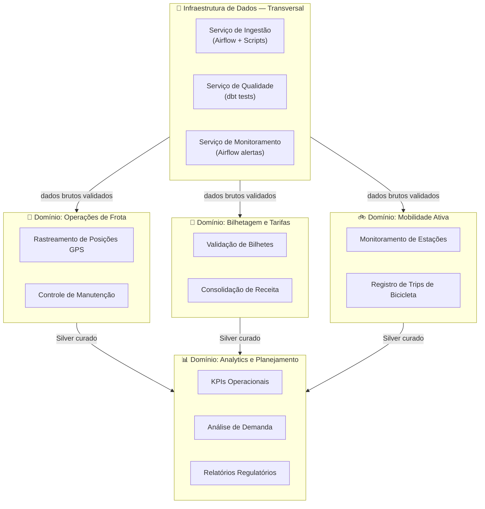
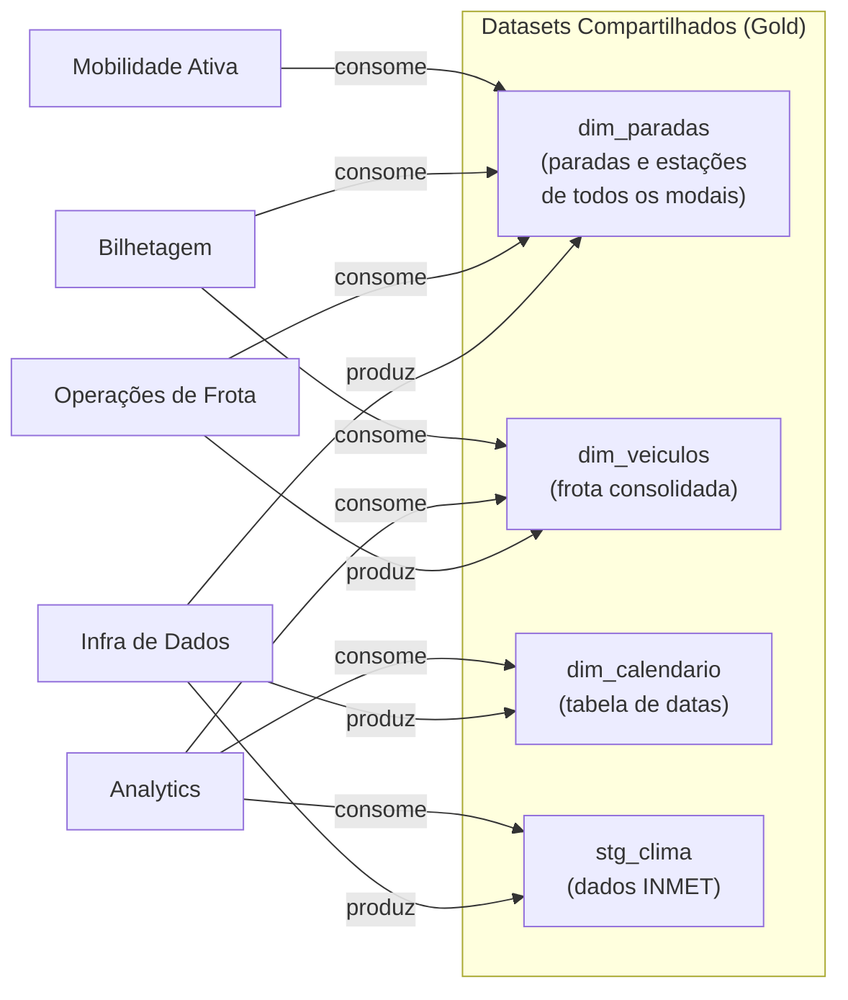
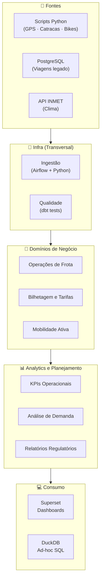

# 3. Domínios e Serviços

## 3.1 Abordagem: Domain-Driven Design aplicado à Engenharia de Dados

A organização dos dados e serviços do UrbanFlow segue princípios do **Domain-Driven Design (DDD)** adaptados à engenharia de dados. Cada **domínio** representa uma área de negócio coesa com **ownership claro** sobre seus dados e pipelines. Isso reduz o acoplamento entre áreas e facilita a evolução independente de cada parte do sistema.

O projeto identifica **4 domínios**: 3 de negócio e 1 transversal de infraestrutura.

---

## 3.2 Mapa Geral de Domínios

---

## 3.3 Detalhamento dos Domínios

### 3.3.1 Domínio: Operações de Frota 🚌

**Owner:** Gerência de Operações  
**Dados produzidos:** Posição de cada veículo, status (em rota / atrasado), velocidade, taxa de ocupação.

| Serviço | Responsabilidade | Entrada | Saída |
|---|---|---|---|
| **Rastreamento GPS** | Consolidar posições GPS diárias; calcular atraso vs. horário previsto | Bronze `gps_onibus` | Silver: `gps_onibus_clean` |
| **Controle de Manutenção** | Cruzar registros de ocorrências com veículos ativos | Bronze `viagens` | `dim_veiculos` com status |

**Produz para Gold:**
- `fct_posicoes_diarias` — posição média por veículo/hora/dia
- `kpi_otp_diario` — % de viagens dentro do horário previsto por linha

---

### 3.3.2 Domínio: Bilhetagem e Tarifas 🎫

**Owner:** Gerência Financeira  
**Dados produzidos:** Fluxo de passageiros por estação e horário, receita por modal.

| Serviço | Responsabilidade | Entrada | Saída |
|---|---|---|---|
| **Validação de Bilhetes** | Limpar e deduplicar eventos de catraca | Bronze `catracas` | Silver: `catracas_clean` |
| **Consolidação de Receita** | Agregar receita diária por modal e tipo de cartão | Silver `catracas_clean` + `viagens_clean` | Gold: `fct_receita_diaria` |

---

### 3.3.3 Domínio: Mobilidade Ativa 🚲

**Owner:** Gerência de Mobilidade Sustentável  
**Dados produzidos:** Disponibilidade de bikes por estação, padrões de viagem, score de rebalanceamento.

| Serviço | Responsabilidade | Entrada | Saída |
|---|---|---|---|
| **Monitoramento de Estações** | Status de disponibilidade por estação ao longo do dia | Bronze `bikes_iot` | Silver: `bikes_status_clean` |
| **Registro de Trips** | Identificar início/fim de cada viagem; calcular duração | Silver `bikes_status_clean` | Gold: `fct_trips_bikes` |

---

### 3.3.4 Domínio: Analytics e Planejamento 📊

**Owner:** Diretoria de Planejamento / Equipe de Dados  
**Responsabilidade:** Consumir dados curados de todos os domínios e transformá-los em inteligência acionável.

| Serviço | Responsabilidade | Consome de | Produz |
|---|---|---|---|
| **KPIs Operacionais** | Calcular e publicar KPIs diários de performance | Todos os domínios (Silver/Gold) | Dashboards Superset · `kpi_operacional_diario` |
| **Análise de Demanda** | Padrões de demanda por região, horário e clima | Gold + Meteorologia | `agg_demanda_por_hora` |
| **Relatórios Regulatórios** | Gerar relatórios mensais para a Prefeitura | Gold consolidado | `rpt_regulatorio_mensal` |

---

### 3.3.5 Domínio: Infraestrutura de Dados (Transversal) 🔧

**Owner:** Equipe de Engenharia de Dados  
**Responsabilidade:** Serviços horizontais que suportam todos os domínios. Não possui dados de negócio — garante que os dados cheguem com qualidade e no prazo.

| Serviço | Responsabilidade | Tecnologia |
|---|---|---|
| **Ingestão** | Executar pipelines de extração (batch e simuladores) | Airflow + Python scripts |
| **Qualidade** | Validar schemas e completude antes de promover Bronze→Silver | dbt tests + pandas validations |
| **Monitoramento** | Alertas de falha em DAGs e degradação de qualidade | Airflow e-mail alerts |

---

## 3.4 Serviços Compartilhados Entre Domínios

Alguns datasets são produzidos por um domínio e consumidos por vários outros, exigindo contratos de dados (schemas versionados no Git).

---

## 3.5 Diagrama de Responsabilidades — Resumo Visual

