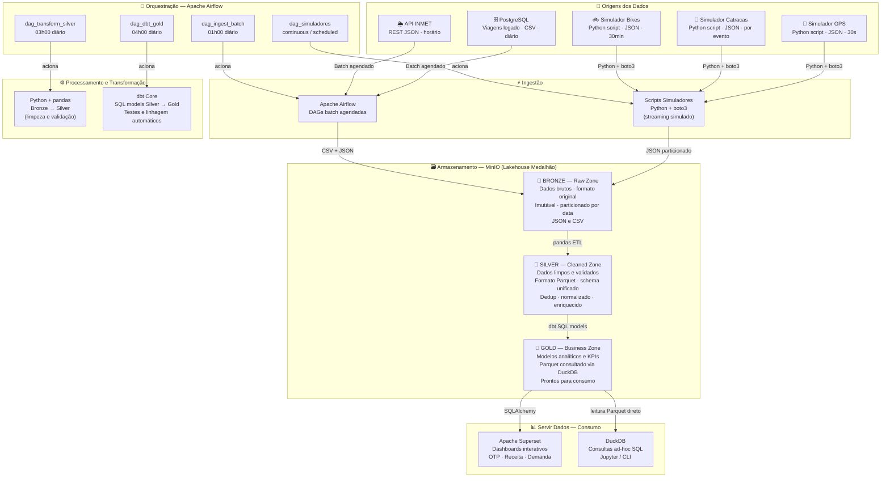
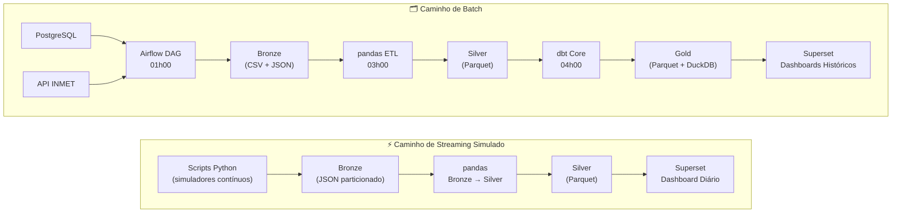

# 4. Arquitetura e Fluxo de Dados

## 4.1 Decisão Arquitetural: Lakehouse com Padrão Medalhão

### Comparativo de Arquiteturas Consideradas

| Arquitetura | Pontos Fortes | Por que foi descartada/limitada |
|---|---|---|
| **Data Warehouse puro** (ex: Redshift, Snowflake) | Excelente para queries SQL analíticas estruturadas | Pago; schema-on-write exige modelagem rígida desde o início; não lida bem com JSON/CSV heterogêneos |
| **Data Lake puro** (arquivos sem camadas) | Flexível, barato, aceita qualquer formato | Sem governança vira um "data swamp"; difícil consultar sem camada analítica; sem qualidade garantida |
| **Arquitetura Lambda** (batch + speed layer separados) | Suporta batch e streaming com baixa latência | Duplicação de lógica nos dois paths torna manutenção cara; complexidade alta para um protótipo |
| **Arquitetura Kappa** (apenas streaming) | Um único path simplificado | A maioria das fontes é batch (PostgreSQL, API INMET); processar histórico como streaming é artificial |
| **Data Mesh** | Ownership descentralizado, alta autonomia | Requer maturidade organizacional e plataforma estabelecida; escopo atual não justifica a sobrecarga |
| **Lakehouse + Medalhão** ✅ | Flexibilidade do Data Lake + governança de DW; batch e streaming; 100% open-source e gratuito | **ESCOLHIDA** |

### Por que Lakehouse + Medalhão

A arquitetura **Lakehouse** resolve o dilema entre Data Lake (flexível, mas sem governança) e Data Warehouse (governado, mas rígido e caro). Para o UrbanFlow:

1. **Dados heterogêneos:** JSON de GPS, JSON de catracas, CSV de viagens e JSON de APIs — o Data Lake aceita todos sem transformação prévia.
2. **Necessidade analítica:** Dashboards do Superset precisam de queries SQL performáticas — o padrão Medalhão garante uma camada Gold estruturada.
3. **Custo zero:** MinIO + DuckDB reproduzem um Lakehouse completo localmente. A mesma estrutura migra para AWS S3 apenas trocando o endpoint.
4. **Reversibilidade:** A camada Bronze preserva dados brutos e imutáveis. Qualquer erro nas transformações pode ser corrigido reprocessando.

---

## 4.2 Diagrama da Arquitetura Ponta a Ponta



---

## 4.3 As Três Camadas do Padrão Medalhão

### 🥉 Bronze — Raw Zone (Zona Bruta)

A camada Bronze é o **ponto de aterramento** de todos os dados na plataforma.

| Propriedade | Valor |
|---|---|
| **Princípio fundamental** | **Imutabilidade** — dados nunca são sobrescritos ou deletados |
| **Formato** | Formato original preservado: JSON, CSV |
| **Particionamento** | `fonte/ano=YYYY/mes=MM/dia=DD/` |
| **Retenção** | 90 dias |
| **Schema enforcement** | Nenhum — aceita qualquer dado que chegue |

**Por que preservar dados brutos?**
Se a lógica de transformação tiver um bug (ex: calcular velocidade errada), com Bronze imutável basta corrigir o código e reprocessar. Sem Bronze, os dados originais estariam perdidos.

```
urbanflow-bronze/
├── gps_onibus/ano=2026/mes=04/dia=09/hora=08/
│   └── gps_onibus_20260409_0800.json
├── catracas/ano=2026/mes=04/dia=09/
│   └── catracas_20260409.json
├── viagens/ano=2026/mes=04/dia=09/
│   └── viagens_20260409.csv
└── clima/ano=2026/mes=04/dia=09/hora=09/
    └── inmet_20260409_0900.json
```

---

### 🥈 Silver — Cleaned Zone (Zona Limpa)

A camada Silver aplica **contratos de qualidade** sobre os dados brutos via scripts Python com pandas.

| Transformação | O que faz |
|---|---|
| **Deduplicação** | Remove eventos duplicados usando `(vehicle_id, timestamp)` como chave |
| **Normalização de timestamp** | Converte todos os timestamps para UTC ISO 8601 |
| **Validação de campos** | Remove registros com `vehicle_id` nulo ou `speed_kmh < 0` |
| **Enriquecimento** | Join com `dim_veiculos` para adicionar nome da linha e capacidade |
| **Tratamento de outliers** | `speed_kmh > 120` → sinalizado como `is_outlier = true` (não deletado) |

**Formato de saída:** **Parquet** comprimido com Snappy — leitura muito mais rápida que CSV para queries analíticas.

---

### 🥇 Gold — Business Zone (Zona de Negócio)

A camada Gold contém **modelos analíticos** prontos para consumo, organizados em padrão **Star Schema**.

| Tabela | Tipo | Descrição | Atualização |
|---|---|---|---|
| `fct_viagens_diarias` | Fato | Viagens por dia, linha, modal, parada | Diária |
| `fct_receita_diaria` | Fato | Receita por modal, tipo de cartão, dia | Diária |
| `fct_trips_bikes` | Fato | Trips de bicicleta: origem, destino, duração | Diária |
| `dim_veiculos` | Dimensão | Frota: tipo, capacidade, linha | Semanal |
| `dim_paradas` | Dimensão | Paradas e estações com geolocalização | Semanal |
| `dim_calendario` | Dimensão | Datas com feriados e flag de pico | Anual |
| `agg_demanda_por_hora` | Agregação | Demanda por estação × hora × dia da semana | Diária |
| `kpi_operacional_diario` | KPI | OTP, passageiros/linha/dia, headway médio | Diária |
| `rpt_regulatorio_mensal` | Relatório | Relatório consolidado para a Prefeitura | Mensal |

---

## 4.4 Caminhos de Batch e Streaming



**Nota sobre a estratégia:** O caminho simulado alimenta o Bronze continuamente durante o dia. O pipeline batch (Airflow) é executado à madrugada, processa o dia anterior completo com toda a lógica de qualidade e materializa os modelos Gold. Os dashboards são atualizados a partir das 06h00 com dados do dia anterior já limpos e validados.

---

## 4.5 Trade-offs Arquiteturais

### Acoplamento

| Decisão | Tipo de Acoplamento | Trade-off |
|---|---|---|
| Scripts Python publicam direto no MinIO | **Fraco** | Simuladores e pipelines são independentes; falha num simulador não afeta os outros |
| Airflow orquestrando batch | **Moderado** | DAGs conhecem os schemas das fontes, mas mudanças são isoladas por DAG |
| dbt modelos Silver → Gold | **Fraco (desejável)** | Modelos SQL independentes; `ref()` controla dependências explicitamente |
| MinIO com API S3 | **Fraco** | Código usa boto3 padrão. Migrar para AWS S3 real = trocar apenas a URL do endpoint |

### Escalabilidade

| Componente | No Protótipo | Caminho de Escala em Produção |
|---|---|---|
| **Scripts simuladores** | Processo Python local | Substituir por dispositivos reais + Apache Kafka como broker de mensagens |
| **pandas ETL** | Single-node, em memória | Substituir por Apache Spark para volumes acima de alguns GB |
| **MinIO** | 1 nó local | MinIO Distributed Mode ou migrar para AWS S3 |
| **DuckDB** | Single-node, in-process | Para datasets > 50 GB: substituir por ClickHouse ou BigQuery |
| **Airflow** | LocalExecutor | CeleryExecutor ou KubernetesExecutor para paralelismo real |

### Disponibilidade e Confiabilidade

| Componente | Mecanismo |
|---|---|
| **Airflow** | `retries=3` com `retry_delay=5min` em todos os DAGs; re-execução manual via UI |
| **Bronze imutável** | Dados nunca deletados — reprocessamento sempre possível |
| **dbt tests** | Testes `not_null` e `unique` executados após cada materialização Gold |
| **pandas validations** | Scripts de limpeza registram contagem de linhas rejeitadas em log |

### Reversibilidade

1. **Código versionado no Git:** DAGs, scripts Python e modelos dbt versionados — qualquer estado anterior restaurável com `git checkout`.
2. **Bronze imutável:** Reprocessar Silver e Gold a partir do Bronze é sempre possível.
3. **Particionamento Parquet:** Reprocessar apenas uma partição de data específica sem tocar no histórico.