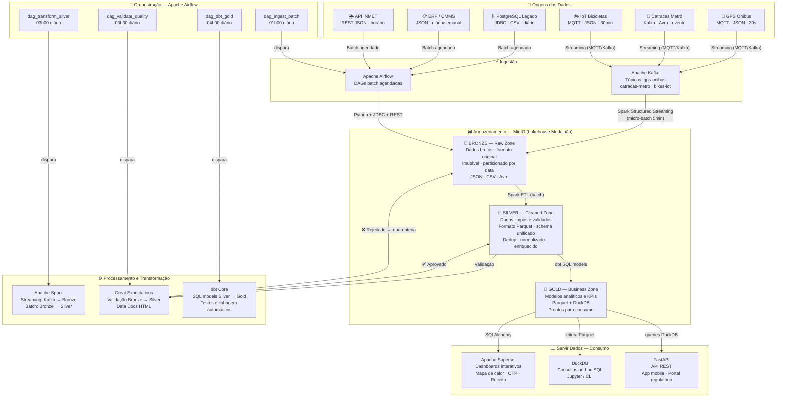
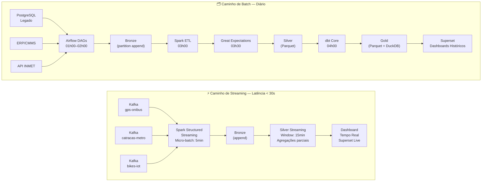

# 4. Arquitetura e Fluxo de Dados

## 4.1 Decisão Arquitetural: Lakehouse com Padrão Medalhão

### Comparativo de Arquiteturas Consideradas

Antes de escolher a arquitetura, avaliamos as principais alternativas estudadas em aula:

| Arquitetura | Pontos Fortes | Por que foi descartada/limitada |
|---|---|---|
| **Data Warehouse puro** (ex: Redshift, Snowflake) | Excelente para queries SQL analíticas estruturadas | Não lida bem com JSON/Avro de IoT e GPS; todas as opções de DW gerenciado são pagas; schema-on-write exige modelagem prévia rígida |
| **Data Lake puro** (arquivos no S3 sem camadas) | Flexível, barato, aceita qualquer formato | Sem governança, vira um "data swamp"; difícil consultar sem uma camada analítica; sem qualidade garantida |
| **Arquitetura Lambda** (batch + speed layer separados) | Suporta batch e streaming simultaneamente com baixa latência | Duplicação de lógica de negócio nos dois paths (batch e speed) torna manutenção muito cara; complexidade operacional alta para um protótipo |
| **Arquitetura Kappa** (apenas streaming) | Simplifica mantendo apenas um path (streaming para tudo) | Nossa maioria de fontes é batch (4 de 7); processar CSVs históricos como streaming é artificial e ineficiente |
| **Data Mesh** | Ownership descentralizado por domínio, alta autonomia | Requer maturidade organizacional e plataforma de dados bem estabelecida; escopo atual não justifica a sobrecarga de governança distribuída |
| **Lakehouse + Medalhão** ✅ | Combina flexibilidade do Data Lake com governança de DW; suporta batch e streaming; 100% open-source | **ESCOLHIDA** — melhor relação custo/benefício para o escopo |

### Por que Lakehouse + Medalhão é a escolha certa

A arquitetura **Lakehouse** surgiu para resolver exatamente o dilema entre Data Lake (flexível, mas sem governança) e Data Warehouse (governado, mas rígido e caro). No contexto do UrbanFlow:

1. **Dados heterogêneos:** Temos JSON de GPS, Avro de catracas, CSV de viagens e JSON de APIs — o Data Lake aceita todos sem transformação prévia.
2. **Necessidade analítica:** Precisamos de queries SQL performáticas para os dashboards do Superset — o padrão Medalhão garante uma camada Gold estruturada.
3. **Custo zero:** MinIO (S3-compatível) + DuckDB reproduzem um Lakehouse completo sem pagar nada. A mesma estrutura seria migrada para S3 + Athena/BigQuery em produção com mínimas mudanças de código.
4. **Reversibilidade:** A camada Bronze preserva dados brutos e imutáveis. Qualquer erro nas transformações pode ser corrigido reprocessando desde o início — princípio fundamental da engenharia de dados moderna.

---

## 4.2 Diagrama da Arquitetura Ponta a Ponta



---

## 4.3 As Três Camadas do Padrão Medalhão

### 🥉 Bronze — Raw Zone (Zona Bruta)

A camada Bronze é o **ponto de aterramento** de todos os dados na plataforma.

| Propriedade | Valor |
|---|---|
| **Princípio fundamental** | **Imutabilidade** — dados nunca são sobrescritos ou deletados |
| **Formato** | Formato original preservado: JSON, CSV, Avro |
| **Particionamento** | `fonte=gps_onibus/ano=2026/mes=04/dia=09/hora=08/` |
| **Retenção** | 90 dias para streaming · 1 ano para batch |
| **Compressão** | Gzip para CSV; sem compressão para JSON (facilita inspeção) |
| **Schema enforcement** | Nenhum — aceita qualquer dado que chegue |

**Por que preservar dados brutos?**  
Se a lógica de transformação tiver um bug (ex: calcular velocidade em mph em vez de km/h), com Bronze imutável basta corrigir o código e reprocessar. Sem Bronze, os dados originais estariam perdidos.

```
urbanflow-bronze/
├── gps_onibus/ano=2026/mes=04/dia=09/hora=08/
│   └── gps_onibus_20260409_0800_part00.json.gz
├── catracas/ano=2026/mes=04/dia=09/
│   └── catracas_20260409_part00.avro
├── viagens/ano=2026/mes=04/dia=09/
│   └── viagens_20260409.csv.gz
└── clima/ano=2026/mes=04/dia=09/hora=09/
    └── inmet_20260409_0900.json
```

---

### 🥈 Silver — Cleaned Zone (Zona Limpa)

A camada Silver aplica **contratos de qualidade** sobre os dados brutos.

| Transformação | O que faz | Tecnologia |
|---|---|---|
| **Deduplicação** | Remove eventos duplicados usando `(vehicle_id, timestamp)` como chave composta | Spark `dropDuplicates()` |
| **Normalização de timestamp** | Converte todos os timestamps para **UTC ISO 8601** | Spark `to_utc_timestamp()` |
| **Validação de schema** | Rejeita registros com campos obrigatórios nulos | Great Expectations |
| **Enriquecimento** | Join com `dim_veiculos` para adicionar nome da linha, capacidade, tipo | Spark join broadcast |
| **Padronização de colunas** | Renomeia para snake_case, tipos consistentes | Spark `withColumnRenamed()` |
| **Pseudoanonimização** | `card_id` → `card_hash` SHA-256 (já feito no Kafka producer) | Verificação no pipeline |
| **Tratamento de outliers** | `speed_kmh > 120` → sinalizado como `is_outlier = true` (não deletado) | Spark UDF |

**Formato de saída:** **Parquet** (columnar, comprimido com Snappy) — leitura 10–50× mais rápida que CSV para queries analíticas.

---

### 🥇 Gold — Business Zone (Zona de Negócio)

A camada Gold contém **modelos analíticos** prontos para consumo, organizados em padrão **Star Schema** (fatos + dimensões).

| Tabela | Tipo | Descrição | Atualização |
|---|---|---|---|
| `fct_viagens_diarias` | Fato | Viagens por dia, linha, modal, parada | Diária |
| `fct_receita_diaria` | Fato | Receita por modal, tipo de cartão, dia | Diária |
| `fct_trips_bikes` | Fato | Trips de bicicleta: origem, destino, duração | Diária |
| `dim_veiculos` | Dimensão | Frota com atributos: tipo, capacidade, linha | Semanal |
| `dim_paradas` | Dimensão | Todas as paradas e estações com geolocalização | Semanal |
| `dim_calendario` | Dimensão | Tabela de datas com feriados, dia da semana, pico | Anual |
| `agg_demanda_por_hora` | Agregação | Demanda por estação × hora do dia × dia da semana | Diária |
| `kpi_operacional_diario` | KPI | OTP, headway, cobertura, passageiros/linha/dia | Diária |
| `rpt_regulatorio_mensal` | Relatório | Relatório consolidado para a Prefeitura | Mensal |

---

## 4.4 Caminhos de Batch e Streaming



**Nota sobre a estratégia híbrida:** O caminho de streaming alimenta um sub-conjunto da camada Silver com janelas de agregação curtas (para dashboards operacionais). O caminho batch reprocessa o dia completo com toda a lógica de qualidade e enriquecimento, sobreescrevendo a partição do dia na Silver. Isso garante que os dados históricos finais sempre passem pelo pipeline completo de qualidade.

---

## 4.5 Trade-offs Arquiteturais

### Acoplamento

| Decisão | Tipo de Acoplamento | Trade-off |
|---|---|---|
| Kafka como barramento de streaming | **Fraco (desejável)** | Produtores (GPS, IoT) e consumidores (Spark) não se conhecem. Se o Spark cair, os eventos ficam retidos no tópico por 24h sem perda |
| Airflow orquestrando batch | **Moderado** | Os DAGs conhecem os schemas das fontes, mas mudanças são isoladas por DAG. A adição de nova fonte requer apenas novo DAG |
| dbt modelos Silver → Gold | **Fraco (desejável)** | Modelos dbt são SQL puro e independentes. Mudança num modelo não propaga automaticamente para outros (ref() controla dependências explicitamente) |
| MinIO com API S3 | **Fraco** | O código usa boto3 padrão S3. Migrar para AWS S3 real requer apenas mudar a URL endpoint — nenhuma linha de lógica muda |

### Escalabilidade

| Componente | Capacidade no Protótipo | Caminho de Escala em Produção |
|---|---|---|
| **Kafka** | 1 broker, 1 tópico/partição | Adicionar brokers; aumentar partições (0 downtime); usar Kafka MirrorMaker para multi-região |
| **Spark** | Modo `local[*]` (CPUs da máquina) | Modo cluster YARN ou Kubernetes; adicionar workers sem parar o cluster |
| **MinIO** | 1 nó local | MinIO Distributed Mode (4+ nós); ou migrar para AWS S3 (mesma API) |
| **DuckDB** | Single-node, in-process | Para datasets > 100 GB: substituir por ClickHouse (OLAP open-source) ou BigQuery |
| **Airflow** | LocalExecutor (single node) | CeleryExecutor ou KubernetesExecutor para paralelismo real |

### Disponibilidade e Confiabilidade

| Componente | Mecanismo de Confiabilidade |
|---|---|
| **Kafka** | Retenção de 24h garante que nenhum evento se perde se o consumidor cair temporariamente |
| **Airflow** | `retries=3` com `retry_delay=5min` em todos os DAGs; re-execução manual via UI |
| **Bronze imutável** | Dados nunca deletados — fonte da verdade sempre disponível para reprocessamento |
| **Great Expectations** | Detecta regressão de qualidade antes de promover dados para Silver (quarentena automática) |
| **dbt tests** | Testes `not_null` e `unique` executados após cada materialização Gold |

### Reversibilidade

Um princípio central do projeto é que **todas as decisões de transformação são reversíveis**:

1. **Código versionado em Git:** Todos os DAGs Python, modelos dbt SQL e expectations do Great Expectations estão no repositório — qualquer estado anterior pode ser restaurado com `git checkout`.
2. **Bronze imutável:** Reprocessar Silver e Gold a partir do Bronze é sempre possível, mesmo semanas depois.
3. **Particionamento Parquet:** Reprocessar apenas uma partição específica (ex: um único dia) sem precisar reprocessar todo o histórico.
4. **Schema Registry para Avro:** Versões anteriores de schemas ficam registradas, permitindo desserializar mensagens antigas mesmo após evolução do schema.
