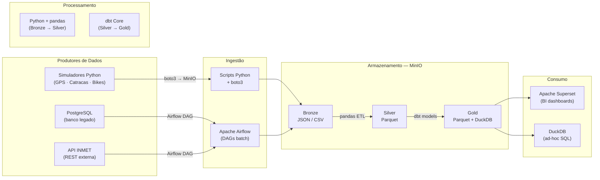

# 5. Tecnologias — Como Será Feito

> **Princípio orientador:** Toda a stack é **100% open-source e gratuita**, executável em uma única máquina via Docker Compose. O ambiente completo sobe com `docker compose up` e não exige conta em nuvem, licença paga ou hardware especial.

---

## 5.1 Visão Geral da Stack



**Requisitos de hardware (estimativa):**

| Serviço | RAM estimada |
|---|---|
| PostgreSQL | ~300 MB |
| Apache Airflow | ~800 MB |
| MinIO | ~300 MB |
| Apache Superset | ~800 MB |
| DuckDB (in-process) | ~200 MB |
| Scripts Python / pandas | ~300 MB |
| **Total** | **~2,7 GB** |

Roda confortavelmente em qualquer máquina com **8 GB de RAM**.

---

## 5.2 Ingestão

### 5.2.1 Scripts Python — Simuladores de Streaming

**O que são:** Scripts Python que simulam o comportamento de dispositivos IoT (GPS de ônibus, catracas de metrô, sensores de bicicleta) gerando eventos JSON realistas e gravando-os diretamente no MinIO, particionados por data e hora.

**Por que simular em vez de usar Kafka + MQTT:**
- Apache Kafka, mesmo em modo single-broker, consome ~1.5 GB de RAM e exige configuração de Zookeeper ou KRaft, Schema Registry e Kafka Connect — overhead grande para um protótipo.
- Os simuladores Python reproduzem fielmente o **volume, a estrutura e a frequência** dos dados reais, permitindo validar toda a cadeia de transformação sem a complexidade de broker de mensagens.
- O conceito de streaming é preservado: os scripts rodam continuamente e publicam dados particionados por janela de tempo, exatamente como um consumidor Kafka faria no Bronze.
- **Integração direta com o MinIO:** os scripts usam boto3 (mesma API do AWS S3), publicando eventos particionados por data e hora — estrutura idêntica à que um consumidor Kafka escreveria na camada Bronze.

**Estrutura dos simuladores:**

```python
# simulador_gps.py — exemplo simplificado
import json, time, random, boto3
from datetime import datetime, timezone

s3 = boto3.client("s3", endpoint_url="http://minio:9000",
                  aws_access_key_id="minioadmin",
                  aws_secret_access_key="minioadmin")

VEHICLES = [f"BUS-{i:04d}" for i in range(1, 851)]
LINES    = [f"L{i:03d}" for i in range(1, 121)]

while True:
    now    = datetime.now(timezone.utc)
    events = []
    for vid, lid in zip(VEHICLES, LINES):
        events.append({
            "vehicle_id":    vid,
            "line_id":       lid,
            "lat":           round(random.uniform(-23.60, -23.50), 4),
            "lon":           round(random.uniform(-46.70, -46.60), 4),
            "speed_kmh":     round(random.uniform(0, 80), 1),
            "occupancy_pct": random.randint(0, 100),
            "status":        random.choice(["on_route", "at_stop", "delayed"]),
            "timestamp":     now.isoformat()
        })

    key = (f"gps_onibus/ano={now.year}/mes={now.month:02d}/"
           f"dia={now.day:02d}/hora={now.hour:02d}/"
           f"gps_{now.strftime('%Y%m%d_%H%M%S')}.json")
    s3.put_object(Bucket="urbanflow-bronze",
                  Key=key,
                  Body=json.dumps(events))
    time.sleep(30)
```

---

### 5.2.2 Apache Airflow — Ingestão Batch

**O que é:** Plataforma de orquestração de workflows definidos como DAGs (Directed Acyclic Graphs) em Python. Cada pipeline de dados é um DAG com tarefas, dependências e agendamento.

**Por que Airflow e não alternativas:**
- **Prefect / Dagster:** Funcionalidades avançadas requerem plano pago em nuvem; ecossistema menor.
- **cron + scripts:** Sem UI de monitoramento, sem histórico de execuções, sem retry automático.
- **Airflow:** 100% open-source (Apache 2.0); UI web completa com histórico e re-execução manual; `retries` nativos; providers oficiais para PostgreSQL, HTTP e S3.

**DAGs de ingestão planejadas:**

| DAG ID | Schedule | Fonte | Destino Bronze | Operador |
|---|---|---|---|---|
| `dag_ingest_viagens` | `0 1 * * *` | PostgreSQL legado | `bronze/viagens/` | `PostgresHook` + boto3 |
| `dag_ingest_clima` | `0 * * * *` | API INMET (REST) | `bronze/clima/` | `SimpleHttpOperator` + boto3 |

---

## 5.3 Armazenamento

### 5.3.1 MinIO — Object Storage (Núcleo do Lakehouse)

**O que é:** Implementação open-source de object storage 100% compatível com a API do **Amazon S3**.

**Por que MinIO:**
- Mesma API S3 → código boto3 funciona identicamente em dev e em nuvem (só muda a URL do endpoint).
- Console web para navegar e inspecionar arquivos de qualquer camada.
- Imagem Docker leve (~200 MB) e sem configuração complexa.
- **Portabilidade:** o código usa boto3 padrão S3. Trocar MinIO por AWS S3 real requer apenas alterar a URL do endpoint — nenhuma linha de lógica muda.

**Estrutura de buckets:**

```
urbanflow-bronze/           # Dados brutos imutáveis (JSON e CSV)
├── gps_onibus/ano=2026/mes=04/dia=09/hora=08/
├── catracas/ano=2026/mes=04/dia=09/
├── bikes_iot/ano=2026/mes=04/dia=09/
├── viagens/ano=2026/mes=04/dia=09/
└── clima/ano=2026/mes=04/dia=09/hora=09/

urbanflow-silver/           # Parquet limpo e validado
├── gps_onibus_clean/ano=2026/mes=04/dia=09/
├── catracas_clean/ano=2026/mes=04/dia=09/
├── bikes_status_clean/ano=2026/mes=04/dia=09/
└── viagens_clean/ano=2026/mes=04/dia=09/

urbanflow-gold/             # Modelos analíticos (Parquet)
├── fct_viagens_diarias/
├── fct_receita_diaria/
├── agg_demanda_por_hora/
├── kpi_operacional_diario/
└── dim_veiculos/ · dim_paradas/ · dim_calendario/
```

---

### 5.3.2 DuckDB — Motor Analítico (Camada Gold)

**O que é:** Banco de dados analítico **in-process** e columnar. Funciona como uma biblioteca Python que executa SQL diretamente sobre arquivos Parquet no MinIO — sem servidor adicional.

**Por que DuckDB:**
- Lê Parquet diretamente do MinIO via extensão `httpfs`: `SELECT * FROM read_parquet('s3://urbanflow-gold/...')`
- Funciona como adapter do dbt (`dbt-duckdb`) — sem infraestrutura extra.
- Conector SQLAlchemy para o Superset.
- Zero configuração: `pip install duckdb` e pronto.
- Open-source (MIT License).

**Integração com dbt:**

```yaml
# profiles.yml
urbanflow:
  target: dev
  outputs:
    dev:
      type: duckdb
      path: /opt/urbanflow/gold.duckdb
      extensions:
        - httpfs    # lê S3/MinIO diretamente
        - parquet   # suporte nativo a Parquet
```

---

### 5.3.3 PostgreSQL — Banco Operacional

**Usos no projeto:**
1. **Simula o banco legado de bilhetagem** — fonte dos dados históricos de viagens (populado com dados gerados pelo Faker).
2. **Metadados do Airflow** — estado de DAGs, execuções e conexões.

---

## 5.4 Processamento e Transformação

### 5.4.1 Python + pandas — Bronze → Silver

**O que é:** Scripts Python usando pandas para limpeza, validação e transformação dos dados brutos da camada Bronze.

**Por que pandas e não Apache Spark:**
- Apache Spark exige JVM, configuração de cluster e consome 2–4 GB de RAM apenas na inicialização — overhead injustificado para os volumes do projeto (~10.000 registros/dia de viagens, ~12.000 eventos de catracas).
- pandas processa esses volumes em segundos, com código Python direto, sem infraestrutura adicional.
- A lógica de transformação (deduplicação, normalização, joins) é idiomática em pandas e diretamente portável para PySpark em cenários de maior volume.

**Exemplo de transformação Bronze → Silver:**

```python
import pandas as pd
import boto3, io

s3 = boto3.client("s3", endpoint_url="http://minio:9000", ...)

# Lê Bronze
obj = s3.get_object(Bucket="urbanflow-bronze", Key="gps_onibus/ano=2026/mes=04/dia=09/...")
df = pd.read_json(io.BytesIO(obj["Body"].read()))

# Limpeza e validação
df = df.dropna(subset=["vehicle_id", "timestamp"])
df = df.drop_duplicates(subset=["vehicle_id", "timestamp"])
df["timestamp"] = pd.to_datetime(df["timestamp"], utc=True)
df["is_outlier"] = df["speed_kmh"] > 120
df = df[df["speed_kmh"] >= 0]  # remove negativos

# Escreve Silver em Parquet
buffer = io.BytesIO()
df.to_parquet(buffer, engine="pyarrow", compression="snappy", index=False)
s3.put_object(Bucket="urbanflow-silver",
              Key="gps_onibus_clean/ano=2026/mes=04/dia=09/part-00000.snappy.parquet",
              Body=buffer.getvalue())
```

---

### 5.4.2 dbt Core — Silver → Gold

**O que é:** Ferramenta de transformação baseada em SQL com controle de versão, testes automatizados e geração de linhagem. O engenheiro escreve SQL; o dbt cuida da ordem de execução, materialização e testes.

**Por que dbt:**
- Gera automaticamente o DAG de dependências entre modelos via `ref()`.
- Testes nativos (`not_null`, `unique`, `accepted_values`) rodam após cada materialização.
- `dbt docs generate` cria documentação HTML com linhagem completa dos dados.
- 100% open-source (Apache 2.0); dbt Core roda via CLI sem custo.

**Estrutura de modelos:**

```
models/
├── staging/              ← Lê Silver (Parquet via DuckDB), padroniza colunas
│   ├── stg_viagens.sql
│   ├── stg_gps_onibus.sql
│   ├── stg_catracas.sql
│   └── stg_bikes.sql
├── intermediate/         ← Joins com dimensões
│   ├── int_viagens_enriquecidas.sql
│   └── int_passageiros_por_hora.sql
└── marts/                ← Tabelas Gold finais
    ├── fct_viagens_diarias.sql
    ├── fct_receita_diaria.sql
    ├── agg_demanda_por_hora.sql
    ├── kpi_operacional_diario.sql
    └── rpt_regulatorio_mensal.sql
```

**Exemplo de modelo dbt:**

```sql
-- models/marts/kpi_operacional_diario.sql
{{ config(materialized='table') }}

WITH viagens AS (
    SELECT * FROM {{ ref('int_viagens_enriquecidas') }}
),
horarios AS (
    SELECT * FROM {{ ref('stg_horarios_programados') }}
)

SELECT
    v.trip_date,
    v.line_id,
    v.modal,
    COUNT(v.trip_id)                                          AS total_viagens,
    SUM(v.passengers)                                         AS total_passageiros,
    AVG(v.delay_minutes)                                      AS atraso_medio_min,
    100.0 * SUM(CASE WHEN v.delay_minutes <= 5 THEN 1 ELSE 0 END)
           / COUNT(v.trip_id)                                 AS otp_pct
FROM viagens v
GROUP BY 1, 2, 3
```

**Testes dbt configurados:**

```yaml
# models/marts/schema.yml
models:
  - name: fct_viagens_diarias
    columns:
      - name: trip_id
        tests: [unique, not_null]
      - name: modal
        tests:
          - accepted_values:
              values: ['onibus', 'metro', 'bicicleta']
      - name: fare_paid
        tests: [not_null]
```

---

## 5.5 Orquestração

### Apache Airflow — Orquestração Central

**Por que Airflow:**
Centralizar toda orquestração em Airflow elimina a necessidade de múltiplos schedulers. Os scripts pandas e dbt são invocados via `BashOperator` ou `PythonOperator` dentro dos DAGs.

**Todos os DAGs do projeto:**

| DAG ID | Schedule | Etapa | Dependências |
|---|---|---|---|
| `dag_ingest_viagens` | `0 1 * * *` | PostgreSQL → Bronze | Nenhuma |
| `dag_ingest_clima` | `0 * * * *` | API INMET → Bronze | Nenhuma |
| `dag_transform_silver` | `0 3 * * *` | pandas Bronze → Silver | `dag_ingest_viagens` ✅ |
| `dag_dbt_gold` | `0 4 * * *` | dbt Silver → Gold | `dag_transform_silver` ✅ |

> **Nota:** Os simuladores (GPS, catracas, bikes) rodam como processos Python contínuos gerenciados pelo Docker Compose, não como DAGs Airflow, pois precisam de execução ininterrupta — diferente dos jobs batch que têm início e fim.

---

## 5.6 Consumo

### 5.6.1 Apache Superset — Dashboards e BI

**Por que Superset e não Power BI / Tableau / Metabase:**
- Power BI: pago para publicação (Power BI Service); licença Pro ~R$70/usuário/mês.
- Tableau: pago (~US$70/usuário/mês).
- Metabase: boa opção open-source, mas conectividade com DuckDB ainda limitada.
- **Superset:** conecta diretamente ao DuckDB via SQLAlchemy; dashboards interativos com mapas de calor; controle de acesso por roles; 100% open-source (Apache 2.0).

**Dashboards planejados:**

| Dashboard | Usuário Alvo | Visualização |
|---|---|---|
| 📈 **OTP por Linha** | Gestão Operacional | Série temporal + bar chart |
| 💰 **Receita Diária por Modal** | Diretoria Financeira | Stacked bar + linha de meta |
| 🚲 **Disponibilidade de Bikes** | Operações Mobilidade | Gauge por estação |
| 🗺️ **Mapa de Demanda** | Planejamento Urbano | Heatmap geográfico |

---

### 5.6.2 DuckDB — Consultas Ad-hoc

**Uso:** Analistas e cientistas de dados consultam diretamente os arquivos Parquet da camada Gold via DuckDB CLI ou integração com Jupyter Notebook — sem servidor adicional, sem configuração.

```sql
-- Exemplo de query ad-hoc diretamente no Parquet
SELECT line_id, AVG(otp_pct) AS media_otp
FROM read_parquet('s3://urbanflow-gold/kpi_operacional_diario/*.parquet')
WHERE trip_date >= current_date - 30
GROUP BY 1
ORDER BY 2 ASC
LIMIT 10;
```

---

## 5.7 Correntes Transversais

### 5.7.1 Segurança e Privacidade

| Aspecto | Implementação |
|---|---|
| **Pseudoanonimização** | `card_id` → `card_hash` SHA-256 no simulador, antes do armazenamento |
| **Acesso ao MinIO** | Políticas por bucket: Bronze para pipelines; Gold somente leitura para Superset |
| **Secrets no Airflow** | Credenciais em Airflow Connections/Variables (não hardcoded no código) |
| **Autenticação Superset** | Login local com roles (Admin, Analyst, Viewer) |

### 5.7.2 Monitoramento e Alertas

Sem Prometheus/Grafana (overhead desnecessário no protótipo). Monitoramento feito via:
- **Airflow UI:** histórico de execuções, duração, status de cada task.
- **Alertas por e-mail:** configurados no Airflow para falhas após 3 tentativas.
- **dbt test results:** log de testes após cada materialização Gold.
- **Contagem de linhas nos scripts pandas:** logs de registros lidos, rejeitados e escritos em cada etapa.

### 5.7.3 Governança e Documentação

- **dbt docs:** `dbt docs generate` cria documentação HTML com linhagem completa dos modelos Silver → Gold.
- **README e diagramas Mermaid:** documentação da arquitetura versionada no GitHub junto com o código.
- **Git como fonte da verdade:** todos os DAGs, scripts Python e modelos dbt versionados.

### 5.7.4 DataOps e Reprodutibilidade

| Prática | Implementação |
|---|---|
| **Controle de versão** | Todo código no GitHub (DAGs, scripts, modelos dbt, docker-compose) |
| **Ambiente reproduzível** | `docker compose up` sobe todo o ambiente em qualquer máquina com Docker |
| **Testes de dados** | dbt tests (`not_null`, `unique`) + validações nos scripts pandas |
| **Documentação como código** | `README.md` e diagramas Mermaid versionados junto ao código |

---

## 5.8 Resumo da Stack — Tabela de Decisão Final

| Etapa | Tecnologia Escolhida | Alternativa em Produção | Critério Decisivo |
|---|---|---|---|
| Ingestão Streaming | **Scripts Python + boto3** | Apache Kafka + Kafka Connect | Sem overhead de broker; conceito de streaming preservado |
| Ingestão Batch | **Apache Airflow** | Prefect, Dagster | UI completa; 100% open-source; retry nativo |
| Object Storage | **MinIO** | AWS S3 | API S3-compatível; gratuito; migração trivial |
| Motor Analítico | **DuckDB** | ClickHouse, BigQuery | In-process; lê Parquet S3; adapter dbt; zero config |
| Processamento ETL | **Python + pandas** | Apache Spark | Sem JVM; simples; suficiente para volume do protótipo |
| Transformação SQL | **dbt Core** | SQL manual | Testes nativos; linhagem; versionado em Git |
| Visualização | **Apache Superset** | Power BI, Tableau | 100% gratuito; conecta ao DuckDB; mapas; roles |
| Infraestrutura | **Docker Compose** | Kubernetes | Sobe tudo com 1 comando; reproduzível |