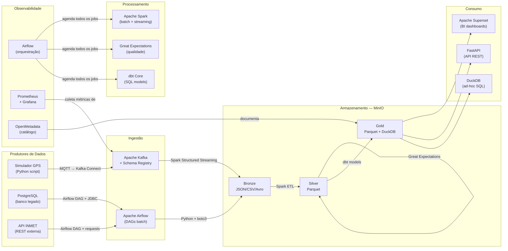
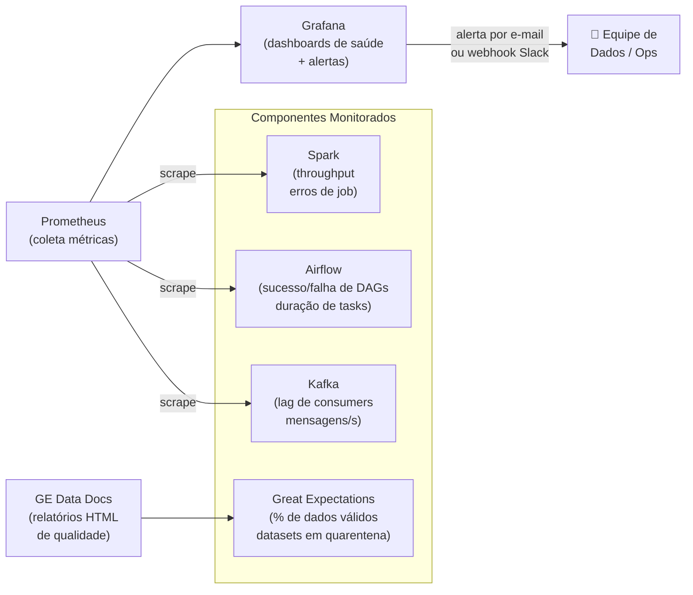

# 5. Tecnologias — Como Será Feito

> **Princípio orientador:** Toda a stack é **100% open-source e gratuita**, executável em uma única máquina via Docker Compose. Nenhuma ferramenta exige conta em nuvem, licença paga ou plano premium.

---

## 5.1 Visão Geral da Stack e Integração



---

## 5.2 Ingestão

### 5.2.1 Apache Kafka — Ingestão de Streaming

**O que é:** Plataforma distribuída de streaming de eventos baseada num modelo de **log imutável e distribuído**. Dados são organizados em *tópicos* com *partições* e ficam retidos por um período configurável, independentemente de os consumidores terem lido ou não.

**Por que não usar alternativas:**
- **AWS Kinesis:** Pago; exige conta AWS; sem controle local.
- **Google Pub/Sub:** Pago; serverless (difícil de reproduzir localmente).
- **RabbitMQ:** Focado em filas transacionais (mensagem desaparece após consumo), não em log imutável com replay — inadequado para o caso de uso de streaming analítico.

**Por que Kafka é a escolha certa:**
- Log imutável com retenção configurável → consumidores podem fazer *replay* de mensagens passadas (fundamental para reprocessamento)
- Desacopla completamente produtores e consumidores (produtores não sabem quem consome)
- Throughput de centenas de milhares de mensagens/segundo em hardware modesto
- Suporte nativo a Spark Structured Streaming via conector oficial
- Imagem Docker oficial (`confluentinc/cp-kafka` com KRaft — sem necessidade de Zookeeper)

**Como se integra no UrbanFlow:**

```
[Dispositivo GPS] --(MQTT)--> [Kafka Connect MQTT Connector] --> [Tópico: gps-onibus]
[Catraca Metrô]   --(Avro via cliente Kafka)----------------> [Tópico: catracas-metro]
[IoT Bicicleta]   --(MQTT)--> [Kafka Connect MQTT Connector] --> [Tópico: bikes-iot]
                                                                        ↓
                                              [Spark Structured Streaming Consumer]
                                                                        ↓
                                                              [Bronze - MinIO]
```

**Tópicos e configurações:**

| Tópico | Partições | Retenção | Formato | Chave de Partição |
|---|---|---|---|---|
| `gps-onibus` | 4 | 24h | JSON | `vehicle_id` |
| `catracas-metro` | 2 | 24h | Avro | `station_id` |
| `bikes-iot` | 2 | 24h | JSON | `bike_id` |

**Limitação no protótipo:** 1 broker com fator de replicação 1 (sem tolerância a falha). Em produção: 3+ brokers, replicação 3, `min.insync.replicas=2`.

---

### 5.2.2 Apache Airflow — Ingestão Batch

**O que é:** Plataforma de orquestração de workflows (DAGs — Directed Acyclic Graphs) baseada em Python. Cada pipeline de dados é definido como um DAG com tarefas, dependências e agendamento.

**Por que não usar alternativas:**
- **Fivetran / Airbyte:** Têm versão open-source limitada; Fivetran é pago; Airbyte open-source é mais pesado e adequado para muitos conectores out-of-the-box. Para 4 fontes batch com lógica customizada, Airflow é mais simples.
- **Prefect / Dagster:** Têm cloud pago para features avançadas; menor comunidade; Airflow tem o ecossistema mais maduro.

**Por que Airflow:**
- DAGs são Python puro — toda lógica customizada de extração é implementada diretamente
- UI web nativa com histórico de execuções, re-execução manual e alertas por e-mail
- `retries` e `retry_delay` nativos garantem resiliência sem código adicional
- 100% open-source (Apache License 2.0)
- Providers oficiais para PostgreSQL, HTTP, Amazon S3 (boto3), todos necessários no projeto

**DAGs de ingestão planejadas:**

| DAG ID | Schedule | Fonte | Destino Bronze | Hook/Operator |
|---|---|---|---|---|
| `dag_ingest_viagens` | `0 1 * * *` | PostgreSQL legado | `bronze/viagens/` | `PostgresHook` + `S3Hook` |
| `dag_ingest_frota` | `0 6 * * 1` | ERP (CSV SFTP) | `bronze/frota/` | `SFTPHook` + `S3Hook` |
| `dag_ingest_clima` | `0 * * * *` | API INMET (REST) | `bronze/clima/` | `SimpleHttpOperator` + `S3Hook` |
| `dag_ingest_manutencao` | `0 2 * * *` | CMMS (JSON HTTP) | `bronze/manutencao/` | `SimpleHttpOperator` + `S3Hook` |

---

## 5.3 Armazenamento

### 5.3.1 MinIO — Object Storage (Núcleo do Lakehouse)

**O que é:** Implementação open-source de object storage 100% compatível com a API do **Amazon S3**. Tudo que funciona com boto3 e S3 funciona com MinIO sem alterar uma linha de código.

**Por que não usar diretamente o S3:**
- S3 é pago (por GB armazenado + por requisição)
- Requer conta AWS e configuração de credenciais de nuvem

**Por que MinIO:**
- Mesma API S3 → o código de produção (boto3) funciona identicamente em dev e em nuvem, apenas trocando a URL do endpoint
- Buckets, prefixos, políticas de acesso e lifecycle rules — tudo igual ao S3 real
- Console web para navegar e inspecionar arquivos
- Imagem Docker oficial, leve (~200 MB)
- **Caminho de migração em produção:** Trocar `endpoint_url="http://minio:9000"` por `endpoint_url="https://s3.amazonaws.com"` no boto3 — zero mudança de lógica

**Estrutura de buckets:**

```
urbanflow-bronze/           # Dados brutos imutáveis
├── gps_onibus/
│   └── ano=2026/mes=04/dia=09/hora=08/
│       └── gps_onibus_2026-04-09_08_part0.json.gz
├── catracas/
│   └── ano=2026/mes=04/dia=09/
│       └── catracas_2026-04-09_part0.avro
├── viagens/
│   └── ano=2026/mes=04/dia=09/
│       └── viagens_2026-04-09.csv.gz
└── clima/ · frota/ · manutencao/ ...

urbanflow-silver/           # Parquet limpo e validado
├── gps_onibus_clean/
│   └── ano=2026/mes=04/dia=09/
│       └── part-00000.snappy.parquet
├── catracas_clean/
├── viagens_clean/
└── ...

urbanflow-gold/             # Modelos analíticos finais
├── fct_viagens_diarias/
├── fct_receita_diaria/
├── agg_demanda_por_hora/
├── kpi_operacional_diario/
└── rpt_regulatorio_mensal/
```

---

### 5.3.2 DuckDB — Motor Analítico (Camada Gold)

**O que é:** Banco de dados analítico **in-process** e columnar, sem servidor. Funciona como uma biblioteca Python que executa SQL diretamente sobre arquivos Parquet, CSV ou JSON — sem precisar importar nada.

**Por que não usar alternativas:**
- **BigQuery / Redshift / Snowflake:** Pagos; exigem conta em nuvem
- **PostgreSQL para analytics:** OLTP, não otimizado para queries analíticas (full table scans lentos em tabelas grandes)
- **Apache Hive:** Requer cluster Hadoop; pesado demais para protótipo local
- **ClickHouse:** Excelente para produção em alta escala, mas tem overhead de configuração maior que DuckDB para protótipo

**Por que DuckDB:**
- Lê Parquet diretamente do MinIO via S3 sem importação: `SELECT * FROM read_parquet('s3://urbanflow-gold/...')`
- Performance analítica excelente para até dezenas de GB em single-node
- Funciona como adapter do dbt (`dbt-duckdb`) — sem servidor adicional
- SQLAlchemy connector para Superset
- Zero configuração — `pip install duckdb` e já está pronto
- Open-source (MIT License)

**Integração com dbt:**

```python
# profiles.yml do dbt
urbanflow:
  target: dev
  outputs:
    dev:
      type: duckdb
      path: /opt/urbanflow/gold.duckdb
      extensions:
        - httpfs      # lê S3/MinIO diretamente
        - parquet     # suporte nativo a Parquet
```

---

### 5.3.3 PostgreSQL — Banco Operacional

**Usos no projeto:**
1. **Simula o banco legado de bilhetagem** — fonte dos dados históricos de viagens
2. **Metadados do Airflow** — estado de DAGs, execuções, variáveis, conexões
3. **Metadados do dbt** — resultados de testes e runs

Escolhido por ser o banco relacional open-source mais maduro, amplamente suportado pelo ecossistema (Airflow, dbt, Great Expectations).

---

## 5.4 Processamento e Transformação

### 5.4.1 Apache Spark (PySpark)

**O que é:** Framework distribuído de processamento de dados em larga escala, com suporte a batch e streaming no mesmo motor.

**Por que não usar alternativas:**
- **Apache Flink:** Excelente para streaming de baixíssima latência (millisegundos), mas a curva de aprendizado é maior e a integração com o ecossistema Python é menos madura que o PySpark
- **pandas:** Não escala além da memória RAM da máquina; sem suporte nativo a Kafka; adequado apenas para DataFrames pequenos
- **Apache Beam:** Portabilidade entre runners (Flink, Spark, Dataflow), mas overhead de abstração e sem runner local eficiente para ambos os casos

**Por que Spark:**
- Um único framework para **batch** (Bronze→Silver) **e streaming** (Kafka→Bronze) — sem duplicação de stack
- `spark.readStream.format("kafka")` consome tópicos Kafka nativamente
- Modo `local[*]` usa todas as CPUs da máquina sem cluster — adequado para protótipo
- PySpark permite código Python familiar

**Uso no protótipo:**

```python
# Streaming: Kafka → Bronze
df_stream = (spark.readStream
    .format("kafka")
    .option("kafka.bootstrap.servers", "kafka:9092")
    .option("subscribe", "gps-onibus")
    .load())

df_stream.writeStream \
    .format("json") \
    .option("checkpointLocation", "/tmp/checkpoints/gps") \
    .option("path", "s3a://urbanflow-bronze/gps_onibus/") \
    .trigger(processingTime="5 minutes") \
    .start()

# Batch: Bronze → Silver
df_gps = spark.read.json("s3a://urbanflow-bronze/gps_onibus/ano=2026/mes=04/dia=09/")
df_clean = (df_gps
    .dropDuplicates(["vehicle_id", "timestamp"])
    .filter(col("speed_kmh").between(0, 120))
    .withColumn("timestamp", to_utc_timestamp("timestamp", "UTC"))
    .withColumn("is_outlier", col("speed_kmh") > 90))

df_clean.write.mode("overwrite").parquet("s3a://urbanflow-silver/gps_onibus_clean/ano=2026/mes=04/dia=09/")
```

---

### 5.4.2 dbt Core — Transformação SQL Silver → Gold

**O que é:** Ferramenta de transformação baseada em SQL com controle de versão, testes automatizados e geração de documentação/linhagem. O engenheiro escreve SQL; o dbt cuida da materialização, ordem de execução e testes.

**Por que não usar SQL puro no Spark:**
- SQL puro no Spark não tem testes automatizados, documentação de linhagem ou controle de dependências entre modelos
- dbt gera automaticamente o DAG de dependências entre modelos com `ref()`
- Testes nativos (`not_null`, `unique`, `accepted_values`, `relationships`) rodam após cada materialização

**Por que dbt Core (não dbt Cloud):**
- dbt Cloud é pago para times; dbt Core é 100% open-source e roda via CLI
- Com `dbt-duckdb`, integra perfeitamente com o DuckDB local sem infraestrutura adicional

**Estrutura de modelos planejada:**

```
models/
├── staging/                   ← Lê Silver (Parquet via DuckDB), padroniza colunas
│   ├── stg_viagens.sql
│   ├── stg_gps_onibus.sql
│   ├── stg_catracas.sql
│   └── stg_bikes.sql
├── intermediate/              ← Joins e enriquecimentos com dimensões
│   ├── int_viagens_enriquecidas.sql   ← viagens + dim_veiculos + dim_paradas
│   └── int_passageiros_por_hora.sql   ← catracas agregadas por hora
└── marts/                     ← Tabelas Gold finais (consumidas pelo Superset)
    ├── fct_viagens_diarias.sql
    ├── fct_receita_diaria.sql
    ├── agg_demanda_por_hora.sql
    ├── kpi_operacional_diario.sql
    └── rpt_regulatorio_mensal.sql
```

**Exemplo de modelo dbt:**

```sql
-- models/marts/kpi_operacional_diario.sql
{{ config(materialized='table') }}

WITH viagens AS (
    SELECT * FROM {{ ref('int_viagens_enriquecidas') }}
),
scheduled AS (
    SELECT * FROM {{ ref('stg_horarios_programados') }}
)

SELECT
    v.trip_date,
    v.line_id,
    v.modal,
    COUNT(v.trip_id)                                    AS total_viagens,
    SUM(v.passengers)                                   AS total_passageiros,
    AVG(v.delay_minutes)                                AS atraso_medio_min,
    100.0 * SUM(CASE WHEN v.delay_minutes <= 5 THEN 1 ELSE 0 END)
           / COUNT(v.trip_id)                           AS otp_pct
FROM viagens v
GROUP BY 1, 2, 3
```

---

### 5.4.3 Great Expectations — Qualidade de Dados

**O que é:** Biblioteca Python para definição, validação e documentação de **expectativas** (regras) sobre dados, integrada ao pipeline de ETL.

**Por que não usar apenas testes dbt:**
- Testes dbt rodam na camada Gold (após transformação). Great Expectations valida na camada Bronze/Silver — detecta problemas **antes** de propagar erros para camadas superiores.
- GE valida dados em DataFrames Spark/Pandas durante a execução do pipeline, não após.

**Expectations planejadas por dataset:**

| Dataset | Expectation | Ação se falhar |
|---|---|---|
| `gps_onibus` (Bronze→Silver) | `vehicle_id` não nulo | Quarentena: mover para `bronze/quarentena/gps/` |
| `gps_onibus` | `speed_kmh` entre 0 e 120 | Sinalizar como `is_outlier=true` (não bloquear) |
| `gps_onibus` | `lat` entre -90 e 90, `lon` entre -180 e 180 | Quarentena |
| `catracas` | `fare_paid` >= 0 | Quarentena |
| `catracas` | `direction` em ['ENTRY', 'EXIT'] | Quarentena |
| `viagens` | `trip_date` = data de ontem (T-1) | Alerta de atraso na fonte |
| `viagens` | duplicatas em `trip_id` | Quarentena (deduplicar) |
| Qualquer dataset | % de nulos em campos obrigatórios < 0.5% | Alerta para a equipe |

**Integração com Airflow:**

```python
# No DAG de transformação Silver
from great_expectations_provider.operators.great_expectations import GreatExpectationsOperator

validate_gps = GreatExpectationsOperator(
    task_id="validate_gps_bronze",
    expectation_suite_name="gps_onibus.bronze",
    batch_kwargs={"path": "s3a://urbanflow-bronze/gps_onibus/ano=2026/mes=04/dia={{ ds }}/"},
    fail_task_on_validation_failure=True,
)
```

---

## 5.5 Orquestração

### Apache Airflow — Orquestração Central

**Por que uma única ferramenta de orquestração:**
Centralizar toda orquestração em Airflow evita a necessidade de gerenciar dois sistemas (ex: Airflow para batch + algum scheduler de streaming). O streaming com Spark é iniciado via `SparkSubmitOperator` ou `BashOperator` dentro de DAGs Airflow.

**Comparativo com alternativas:**

| Ferramenta | Vantagens | Por que não usamos |
|---|---|---|
| **Prefect** | UI moderna, cloud-first | Funcionalidades avançadas requerem Prefect Cloud (pago); ecossistema menor |
| **Dagster** | Forte em data assets e lineage | Dagster+ (cloud) é pago; mais complexo para começar; menor adoção no mercado |
| **Luigi** | Simples, sem servidor | Sem UI nativa adequada; menos features; desenvolvimento mais lento |
| **Airflow** ✅ | Maduro, Python puro, UI completa, 100% open-source | — ESCOLHIDO |

**Todos os DAGs do projeto:**

| DAG ID | Schedule | Etapa | Dependências |
|---|---|---|---|
| `dag_ingest_viagens` | `0 1 * * *` | Extrai PostgreSQL → Bronze | Nenhuma |
| `dag_ingest_clima` | `0 * * * *` | Extrai API INMET → Bronze | Nenhuma |
| `dag_ingest_manutencao` | `0 2 * * *` | Extrai CMMS → Bronze | Nenhuma |
| `dag_ingest_frota` | `0 6 * * 1` | Extrai ERP → Bronze | Nenhuma |
| `dag_transform_silver` | `0 3 * * *` | Spark Bronze→Silver | `dag_ingest_viagens` ✅ |
| `dag_validate_quality` | `30 3 * * *` | Great Expectations | `dag_transform_silver` ✅ |
| `dag_dbt_gold` | `0 4 * * *` | dbt Silver→Gold | `dag_validate_quality` ✅ |
| `dag_refresh_dashboards` | `0 5 * * *` | Atualiza caches Superset | `dag_dbt_gold` ✅ |

---

## 5.6 Servir Dados / Consumo

### 5.6.1 Apache Superset — Dashboards e BI

**O que é:** Plataforma de BI e exploração de dados open-source, mantida pela Apache Software Foundation.

**Por que não usar Power BI/Tableau:**
- Power BI: pago para publicação (Power BI Service); licença Pro ~R$70/usuário/mês
- Tableau: pago (~US$70/usuário/mês); sem opção gratuita para múltiplos usuários

**Por que Superset:**
- Conecta diretamente ao DuckDB via SQLAlchemy
- Dashboards interativos com filtros, drill-down, mapas de calor (com Mapbox)
- Controle de acesso por roles (gestor vê diferente do regulador)
- 100% open-source (Apache License 2.0)

**Dashboards planejados:**

| Dashboard | Usuário Alvo | Tipo de Visualização |
|---|---|---|
| 🗺️ **Mapa de Demanda** | Planejamento Urbano | Heatmap geográfico por estação |
| 📈 **OTP por Linha** | Gestão Operacional | Série temporal + bar chart |
| 🚲 **Disponibilidade de Bikes** | Operações Mobilidade | Gauge por estação + mapa |
| 💰 **Receita Diária por Modal** | Diretoria Financeira | Stacked bar + linha de meta |
| ⚠️ **Monitoramento de Frotas** | Gestão Operacional | Mapa em tempo real + alertas |

---

### 5.6.2 FastAPI — API REST para Consumo Externo

**O que é:** Framework Python assíncrono moderno para construção de APIs REST, com geração automática de documentação OpenAPI (Swagger).

**Por que FastAPI:**
- Expõe dados Gold via API para o app mobile dos passageiros (consulta de horários e disponibilidade de bikes)
- Expõe endpoint para download de relatórios regulatórios em formato estruturado (JSON ou CSV)
- Documentação Swagger automática em `/docs` sem configuração adicional
- Open-source, leve, sem custos

**Endpoints planejados:**

```
GET  /api/v1/linhas/{line_id}/proximas-partidas    → próximas saídas previstas
GET  /api/v1/estacoes/bikes/disponibilidade        → disponibilidade atual por estação
GET  /api/v1/relatorio/mensal/{ano}/{mes}          → relatório regulatório em JSON
GET  /api/v1/kpis/operacional/{data}               → KPIs de uma data específica
```

---

## 5.7 Correntes Transversais do Ciclo de Vida

### 5.7.1 Segurança e Privacidade

| Aspecto | Implementação | Justificativa |
|---|---|---|
| **Pseudoanonimização de cartões** | `card_id` → `card_hash` SHA-256 no Kafka producer (antes do armazenamento) | Conformidade com LGPD — dados de passageiros não ficam em claro na plataforma |
| **Acesso ao MinIO** | Políticas por bucket: Bronze leitura/escrita para pipelines; Gold leitura para Superset/FastAPI | Princípio do menor privilégio |
| **Secrets no Airflow** | Credenciais de banco e APIs armazenadas em Airflow Connections/Variables (não hardcoded no código) | Secrets fora do código-fonte |
| **Autenticação no Superset** | Login local com roles (Admin, Analyst, Viewer) | Controle de acesso por perfil de usuário |
| **Autenticação na FastAPI** | API Key via header `X-API-Key` para endpoints externos | Controle de acesso a dados regulatórios |

---

### 5.7.2 Monitoramento e Observabilidade



**Alertas configurados:**
- Consumer lag do Kafka > 10.000 mensagens → alerta (possível lentidão do Spark)
- DAG com falha em 2 retries consecutivos → e-mail para a equipe
- % de dados válidos < 99% no Great Expectations → alerta de qualidade
- Tempo de execução do job Spark > 2× a média histórica → alerta de desempenho

---

### 5.7.3 Governança e Catálogo de Dados

**OpenMetadata** (open-source, licença Apache 2.0):
- Catálogo centralizado de todos os datasets das camadas Silver e Gold
- Linhagem de dados visual (de qual fonte veio cada coluna da tabela Gold)
- Glossário de negócio (ex: o que significa "OTP", "trip_id", "card_hash")
- Contratos de dados: definição formal do schema esperado de cada dataset

**dbt docs:**
- `dbt docs generate` cria automaticamente documentação HTML com o DAG de dependências entre modelos
- Cada modelo tem description, column descriptions e resultados de testes — acessível via `dbt docs serve`

---

### 5.7.4 DataOps e Versionamento

| Prática | Implementação |
|---|---|
| **Controle de versão** | Todo código (DAGs, modelos dbt, expectations, docker-compose) no GitHub |
| **Testes de qualidade** | Great Expectations (dados) + testes dbt (`not_null`, `unique`) + pytest (código Python) |
| **Ambiente reproduzível** | `docker-compose up` sobe todo o ambiente em qualquer máquina com Docker instalado |
| **CI/CD (futuro)** | GitHub Actions para rodar `dbt test` e `pytest` a cada Pull Request |
| **Documentação como código** | `README.md`, diagramas Mermaid e `dbt docs` — tudo versionado junto com o código |

---

## 5.8 Resumo da Stack — Tabela de Decisão Final

| Etapa | Tecnologia Escolhida | Alternativas Consideradas | Critério Decisivo |
|---|---|---|---|
| Ingestão Streaming | **Apache Kafka** | AWS Kinesis, RabbitMQ | Log imutável + replay; 100% gratuito; integração nativa com Spark |
| Ingestão Batch | **Apache Airflow** | Prefect, Luigi, cron | DAGs Python; UI de monitoramento; 100% open-source |
| Object Storage | **MinIO** | AWS S3, GCS | API S3-compatível; 100% local e gratuito |
| Motor Analítico | **DuckDB** | PostgreSQL, ClickHouse | In-process; lê Parquet S3 nativamente; adapter dbt; zero config |
| Processamento | **Apache Spark** | pandas, Apache Flink | Batch + streaming no mesmo motor; PySpark; modo local |
| Transformação SQL | **dbt Core** | SQL manual, Spark SQL | Testes nativos; linhagem; versionado em Git |
| Qualidade de Dados | **Great Expectations** | dbt tests somente | Valida antes de promover Bronze→Silver; Data Docs HTML |
| Visualização | **Apache Superset** | Power BI, Tableau, Metabase | 100% gratuito; conecta ao DuckDB; mapas; controle de acesso |
| API | **FastAPI** | Flask, Django REST | Async; Swagger automático; leve; open-source |
| Monitoramento | **Prometheus + Grafana** | Datadog, New Relic | 100% gratuito; padrão de mercado open-source |
| Catálogo | **OpenMetadata** | Amundsen, DataHub | Linhagem visual; glossário; integração com dbt |
| Infra | **Docker Compose** | Kubernetes, VMs | Sobe tudo com 1 comando; reproduzível; sem overhead de k8s |
