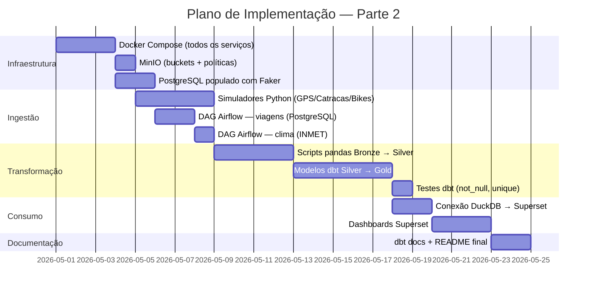

# 6. Considerações Finais

## 6.1 Principais Riscos e Limitações Previstos

| # | Risco | Probabilidade | Impacto | Mitigação |
|---|---|---|---|---|
| R1 | **Superset com DuckDB instável** — a integração via SQLAlchemy pode ter limitações de versão | Média | Alto | Testar a conexão como prova de conceito antes da Parte 2; fallback: usar Jupyter + matplotlib para visualizações |
| R2 | **Volume de dados simulados pequeno** — dados gerados pelo Faker podem não revelar problemas de qualidade reais | Baixa | Médio | Injetar propositalmente dados com problemas (nulos, duplicatas, outliers) nos simuladores para validar o pipeline de qualidade |
| R3 | **Airflow pesado para algumas máquinas** — requer ~800 MB de RAM | Média | Médio | Usar `LocalExecutor` (mais leve); desativar extras desnecessários do Airflow; alternativa: substituir Airflow por scripts Python com agendamento via cron |
| R4 | **API INMET instável ou com mudança de schema** | Média | Baixo | Implementar tratamento de exceção no DAG; armazenar última resposta bem-sucedida no Bronze como fallback |
| R5 | **dbt-duckdb lendo MinIO com httpfs** — pode haver problemas de configuração de credenciais S3 | Média | Alto | Testar na prova de conceito; fallback: dbt lê Parquet de volume local montado no container |

---

## 6.2 Decisões de Design

Ao longo do planejamento, algumas escolhas foram tomadas com base em critérios explícitos de custo, complexidade operacional e aderência ao escopo do projeto:

| Componente | Decisão Adotada | Justificativa |
|---|---|---|
| **Ingestão de eventos** | Scripts Python simulam dispositivos e publicam no MinIO | Elimina a necessidade de broker de mensagens sem abrir mão dos conceitos de eventos particionados por tempo |
| **Processamento ETL** | Python + pandas (single-node) | Volume de dados do projeto não justifica a sobrecarga de JVM do Spark; pandas atende com desempenho adequado |
| **Monitoramento** | Logs do Airflow + dbt test results | Suficiente para observar a saúde dos pipelines sem infraestrutura adicional de telemetria |
| **Catálogo de dados** | dbt docs + README versionado | dbt docs gera linhagem e documentação completa dos modelos sem servidor dedicado |
| **Schema enforcement** | Schemas documentados no README e validados nos scripts | Controle suficiente para as 5 fontes definidas no projeto |

---

## 6.3 Próximos Passos — Parte 2 (Implementação)

A Parte 2 consiste em implementar o que foi planejado aqui. O plano de execução sugerido é:

**Ordem de implementação recomendada:**

1. **Semana 1:** Docker Compose com todos os serviços + MinIO + PostgreSQL com dados Faker
2. **Semana 2:** Simuladores Python + DAGs Airflow de ingestão batch
3. **Semana 3:** Scripts pandas (Bronze → Silver) + modelos dbt (Silver → Gold)
4. **Semana 4:** Superset dashboards + testes dbt + documentação final

---

## 6.4 Referências

- **Reis, J.; Housley, M.** *Fundamentals of Data Engineering.* O'Reilly Media, 2022.
- **Kleppmann, M.** *Designing Data-Intensive Applications.* O'Reilly Media, 2017.
- **dbt Labs.** *dbt Core Documentation.* Disponível em: https://docs.getdbt.com
- **Apache Airflow.** *Airflow Documentation.* Disponível em: https://airflow.apache.org/docs/
- **DuckDB.** *DuckDB Documentation.* Disponível em: https://duckdb.org/docs/
- **MinIO.** *MinIO Documentation.* Disponível em: https://min.io/docs/
- **Apache Superset.** *Superset Documentation.* Disponível em: https://superset.apache.org/docs/
- **INMET.** *API de Dados Meteorológicos.* Disponível em: https://portal.inmet.gov.br/
- **Databricks.** *The Medallion Architecture.* Disponível em: https://www.databricks.com/glossary/medallion-architecture
- **Evans, E.** *Domain-Driven Design: Tackling Complexity in the Heart of Software.* Addison-Wesley, 2003.