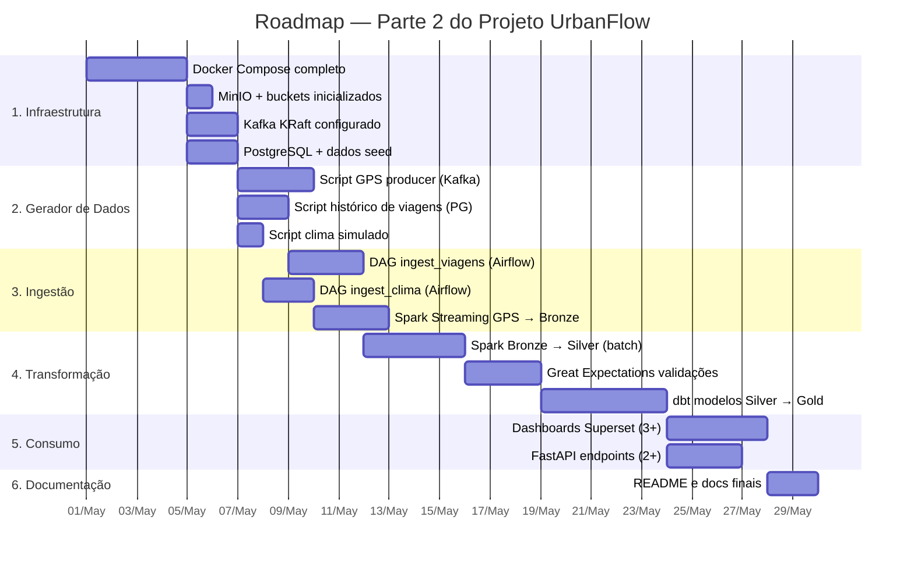

# 6. Considerações Finais

## 6.1 Principais Riscos e Limitações Previstas

### Riscos Técnicos

| # | Risco | Probabilidade | Impacto | Mitigação |
|---|---|---|---|---|
| R1 | **Memória RAM insuficiente** — Kafka + Spark + Airflow + MinIO + Superset + Postgres simultaneamente consomem 12–16 GB RAM | Alta | Alto | Usar perfis Docker Compose separados (`--profile streaming` / `--profile batch`) para desenvolvimento parcial; limitar heap do Spark com `spark.driver.memory=2g` |
| R2 | **Lentidão do Spark em modo local** — sem cluster real, processamento é sequencial | Média | Médio | Datasets simulados menores (ex: 7 dias de GPS) para POC; modo `local[*]` usa todos os cores disponíveis |
| R3 | **Configuração de rede Kafka** — `ADVERTISED_LISTENERS` mal configurado quebra a conectividade entre containers | Média | Alto | Usar configuração KRaft (sem Zookeeper) com a imagem Confluent 7.6; documentar o `docker-compose.yml` com as variáveis corretas |
| R4 | **Schema evolution quebra consumidores** — mudança no formato do GPS sem avisar derruba o pipeline Silver | Baixa | Alto | Usar Kafka Schema Registry com compatibilidade `BACKWARD`; versionar schemas Avro; validar no Great Expectations |
| R5 | **API INMET indisponível** — API pública pode ficar offline ou ter rate limit | Baixa | Baixo | Circuit breaker no DAG (try/except + `on_failure_callback`); fallback para último registro válido na Bronze |
| R6 | **Superset incompatível com DuckDB versão** — mudanças de API entre versões do driver | Baixa | Médio | Fixar versões no `requirements.txt`; testar conexão no `docker-compose up` inicial |

---

### Limitações de Escopo

| Limitação | Por quê existe | Impacto |
|---|---|---|
| **Dados 100% simulados** | Não existe a empresa UrbanFlow de verdade | Volumes e padrões podem diferir da realidade; métricas de desempenho não são representativas de produção |
| **Sem alta disponibilidade** | Docker Compose single-node | 0% tolerância a falha de container; não adequado para produção |
| **Sem TLS/HTTPS** | Overhead de configuração desnecessário para protótipo | Dados trafegam sem criptografia na rede Docker interna |
| **Segurança simplificada** | Foco no ciclo de vida de dados, não em segurança de infra | Credenciais hardcoded no docker-compose (senha mínima); sem LDAP |
| **OpenMetadata como placeholder** | Container pesado (>4 GB RAM); marginal para a avaliação | Catálogo não será totalmente funcional no protótipo — documentação via `dbt docs` compensará |

---

## 6.2 Próximos Passos — Parte 2 (Implementação Prática)

A Parte 2 consiste em **implementar** o que foi planejado aqui. O escopo é deliberadamente realista para ser viável na máquina de desenvolvimento.

### Roadmap de Implementação

### Escopo Mínimo Viável (MVP) da Parte 2

Para garantir que a implementação seja concluída no prazo, definimos o **MVP**:

| Item | Escopo MVP | Nice-to-have |
|---|---|---|
| Fontes implementadas | GPS (streaming) + Viagens (batch) + Clima (batch) | + Manutenção, + Frota |
| Camadas do Lakehouse | Bronze + Silver + Gold | — |
| Validações GE | 5 expectations no GPS + 5 nas Viagens | + Catracas, + Bikes |
| Modelos dbt Gold | `kpi_operacional_diario` + `agg_demanda_por_hora` | + `rpt_regulatorio_mensal` |
| Dashboards Superset | OTP por linha + Demanda por hora | + Mapa de calor |
| Endpoints FastAPI | `/disponibilidade/bikes` + `/kpis/{data}` | + Relatório regulatório |

---

## 6.3 Referências Utilizadas

### Livros

- REIS, Joe; HOUSLEY, Matt. *Fundamentals of Data Engineering: Plan and Build Robust Data Systems*. O'Reilly Media, 2022.
- KLEPPMANN, Martin. *Designing Data-Intensive Applications: The Big Ideas Behind Reliable, Scalable, and Maintainable Systems*. O'Reilly Media, 2017.
- HARREN, Noah et al. *Learning Apache Kafka*. Packt Publishing, 2023.

### Documentações Oficiais

| Tecnologia | URL |
|---|---|
| Apache Kafka | https://kafka.apache.org/documentation/ |
| Apache Airflow | https://airflow.apache.org/docs/ |
| Apache Spark | https://spark.apache.org/docs/latest/ |
| dbt Core | https://docs.getdbt.com/ |
| MinIO | https://min.io/docs/minio/container/index.html |
| DuckDB | https://duckdb.org/docs/ |
| Apache Superset | https://superset.apache.org/docs/intro |
| Great Expectations | https://docs.greatexpectations.io/ |
| FastAPI | https://fastapi.tiangolo.com/ |
| OpenMetadata | https://docs.open-metadata.org/ |

### Artigos e Conceitos

- Databricks — *What is a Data Lakehouse?*: https://www.databricks.com/glossary/data-lakehouse
- Databricks — *Medallion Architecture*: https://www.databricks.com/glossary/medallion-architecture
- dbt Labs — *The dbt Viewpoint*: https://docs.getdbt.com/community/resources/viewpoint
- Fowler, Martin — *Data Mesh Principles and Logical Architecture*: https://martinfowler.com/articles/data-mesh-principles.html
- Kreps, Jay — *The Log: What every software engineer should know about real-time data's unifying abstraction*: https://engineering.linkedin.com/distributed-systems/log-what-every-software-engineer-should-know-about-real-time-datas-unifying

---

## 6.4 Reflexão: Decisões Arquiteturais vs. Princípios de Engenharia de Dados

Resumimos abaixo como as principais decisões deste projeto se conectam diretamente aos conceitos estudados em aula:

| Princípio Visto em Aula | Como se Manifesta no UrbanFlow |
|---|---|
| **Separação entre armazenamento e computação** | MinIO (armazenamento) separado do Spark/DuckDB (computação) — cada um escala independentemente |
| **Imutabilidade dos dados** | Camada Bronze nunca sobrescreve dados; append-only |
| **Dados como produto** | Cada tabela Gold tem owner, SLA, contrato de schema e documentação no catálogo |
| **Baixo acoplamento** | Kafka desacopla produtores de consumidores; dbt `ref()` declara dependências explicitamente |
| **Observabilidade** | Prometheus + Grafana + GE Data Docs + Airflow UI — múltiplas camadas de visibilidade |
| **Reversibilidade** | Bronze imutável + código versionado no Git = qualquer estado pode ser reconstruído |
| **Escalabilidade horizontal** | Kafka: mais partições; Spark: mais workers; MinIO: mais nós — sem reescrever código |
| **Schema-on-Read vs. Schema-on-Write** | Bronze: schema-on-read (flexível); Silver: schema-on-write (Parquet com schema definido) |
